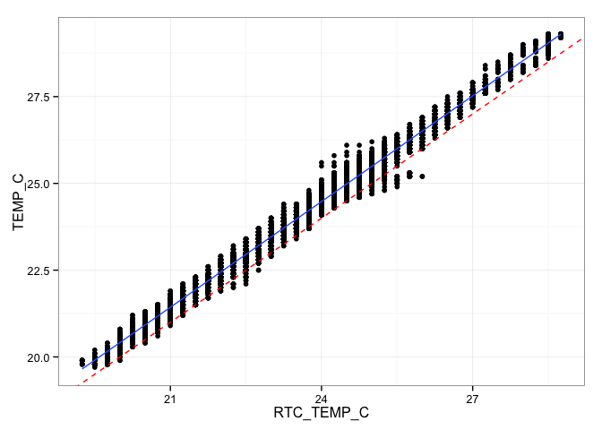
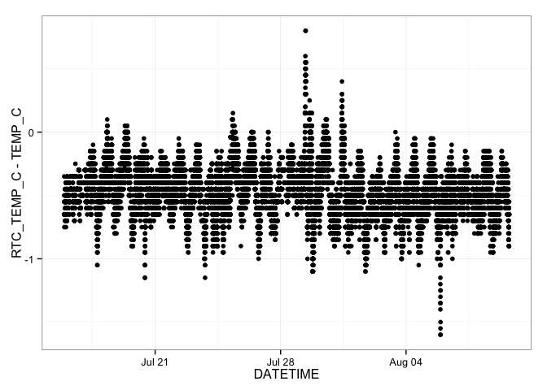
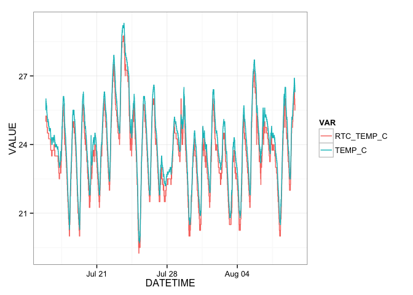
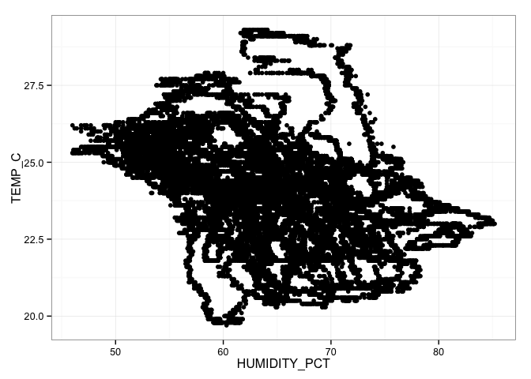

# DHT22 Deployment Summary
Jeffrey D Walker  
July 31, 2014  

This document summarizes data collected using a [Riffle-ito Water Quality Data Logger](https://github.com/p-v-o-s/riffle-ito) connected to a [DHT22 Temperature/Humidity Sensor](http://www.adafruit.com/products/393).

**Sketch**: [riffleito_dht22_logger](https://github.com/walkerjeffd/riffle-ito-apps/blob/e03b1a0b3333b147bcb9e3c6df88cb3119c01e14/ino/riffleito_dht22_logger/riffleito_dht22_logger.ino)

**Purpose**: To determine the stability and battery-lifetime of a single riffle-ito deployment, and to compare the on-board RTC temperature measurements to the DHT22 measurements.

**Description**: The riffle-ito was configured with the sketch above and set to record readings from a DHT22 temperature/humidity sensor every 60 seconds. Three fresh Duracell AA batteries were used to power the riffle-ito. Data were retrieved every few days resulting in short gaps and multiple data files, however the batteries were not changed.  

**Location**: The riffle-ito was placed on my office desk in Brunswick, ME. 

## Set Up

First we'll load the R packages used for this summary.


```r
library(lubridate)
library(dplyr)
library(tidyr)
library(ggplot2)
theme_set(theme_bw())
```

## Load Data

The raw data are stored in the `./data` directory. There are multiple files for this 
deployment because I temporarily removed the SD card from the riffle-ito to download
the data. As shown in the [sketch](), whenever the riffle-ito is powered on, it creates a new logging file by incrementing the last two digits by one.

To load the data, first retrieve a list of the filenames.


```r
filenames <- dir(path='./data', pattern='*.CSV', full.names = TRUE)
filenames
```

```
## [1] "./data/LOGGER41.CSV" "./data/LOGGER42.CSV" "./data/LOGGER43.CSV"
```

The `filenames` vector shows that there are 3 files.

We can then use the `dplyr::rbind_all` file to automatically loop through this set of filenames, load each file, append a column named `FILE` that stores the filename for each dataset, and finally merge the datasets for each file in a single data frame named `df`.


```r
df <- rbind_all(lapply(filenames, function (filename) {
  read.csv(filename, as.is=TRUE) %>%
    mutate(FILE=filename)
}))
head(df)
```

```
##              DATETIME RTC_TEMP_C TEMP_C HUMIDITY_PCT BATTERY_LEVEL
## 1 2014-07-15 22:10:03      25.00   25.5        75.80          7.33
## 2 2014-07-15 22:11:04      25.25   25.6        71.69          7.35
## 3 2014-07-15 22:12:05      25.25   25.8        69.69          7.35
## 4 2014-07-15 22:13:06      25.25   25.8        69.40          7.35
## 5 2014-07-15 22:14:07      25.25   25.9        68.90          7.35
## 6 2014-07-15 22:15:08      25.25   25.9        68.69          7.35
##                  FILE
## 1 ./data/LOGGER41.CSV
## 2 ./data/LOGGER41.CSV
## 3 ./data/LOGGER41.CSV
## 4 ./data/LOGGER41.CSV
## 5 ./data/LOGGER41.CSV
## 6 ./data/LOGGER41.CSV
```

Next, we want to parse the datetimes using `lubridate::ymd_hms()` to `POSIXct` objects, and convert the `FILE` column to a factor.


```r
df <- mutate(df,
             DATETIME=ymd_hms(DATETIME),
             FILE=factor(FILE))
summary(df)
```

```
##     DATETIME                     RTC_TEMP_C       TEMP_C    
##  Min.   :2014-07-15 22:10:03   Min.   :19.2   Min.   :19.7  
##  1st Qu.:2014-07-19 21:59:22   1st Qu.:22.5   1st Qu.:22.9  
##  Median :2014-07-23 21:51:43   Median :23.8   Median :24.2  
##  Mean   :2014-07-23 21:47:44   Mean   :23.7   Mean   :24.1  
##  3rd Qu.:2014-07-27 21:36:56   3rd Qu.:24.8   3rd Qu.:25.1  
##  Max.   :2014-07-31 21:19:16   Max.   :28.8   Max.   :29.3  
##   HUMIDITY_PCT  BATTERY_LEVEL                   FILE      
##  Min.   :46.0   Min.   :6.72   ./data/LOGGER41.CSV: 4119  
##  1st Qu.:59.6   1st Qu.:6.78   ./data/LOGGER42.CSV: 5062  
##  Median :64.6   Median :6.86   ./data/LOGGER43.CSV:13451  
##  Mean   :65.4   Mean   :6.90                              
##  3rd Qu.:71.4   3rd Qu.:6.99                              
##  Max.   :85.2   Max.   :7.35
```

The data are currently in a wide format, where each column represents a single variable (see [Tidy Data](http://vita.had.co.nz/papers/tidy-data.pdf) and [Reshaping Data with the reshape Package](http://www.jstatsoft.org/v21/i12/paper) by Hadley Wickham for more information about long/wide formats, and note that `tidyr` is a relatively new package that provides much of the same functionality as the `reshape2` package). 

For plotting, it will be easier to convert to a long format. This can easily be done using the `tidyr::gather` function.


```r
df <- gather(df, VAR, VALUE, RTC_TEMP_C:BATTERY_LEVEL)
head(df)
```

```
##              DATETIME                FILE        VAR VALUE
## 1 2014-07-15 22:10:03 ./data/LOGGER41.CSV RTC_TEMP_C 25.00
## 2 2014-07-15 22:11:04 ./data/LOGGER41.CSV RTC_TEMP_C 25.25
## 3 2014-07-15 22:12:05 ./data/LOGGER41.CSV RTC_TEMP_C 25.25
## 4 2014-07-15 22:13:06 ./data/LOGGER41.CSV RTC_TEMP_C 25.25
## 5 2014-07-15 22:14:07 ./data/LOGGER41.CSV RTC_TEMP_C 25.25
## 6 2014-07-15 22:15:08 ./data/LOGGER41.CSV RTC_TEMP_C 25.25
```

```r
summary(df)
```

```
##     DATETIME                                    FILE      
##  Min.   :2014-07-15 22:10:03   ./data/LOGGER41.CSV:16476  
##  1st Qu.:2014-07-19 21:59:22   ./data/LOGGER42.CSV:20248  
##  Median :2014-07-23 21:51:43   ./data/LOGGER43.CSV:53804  
##  Mean   :2014-07-23 21:47:44                              
##  3rd Qu.:2014-07-27 21:36:56                              
##  Max.   :2014-07-31 21:19:16                              
##             VAR            VALUE      
##  RTC_TEMP_C   :22632   Min.   : 6.72  
##  TEMP_C       :22632   1st Qu.:16.27  
##  HUMIDITY_PCT :22632   Median :23.90  
##  BATTERY_LEVEL:22632   Mean   :30.03  
##                        3rd Qu.:33.48  
##                        Max.   :85.20
```

The data are now in long format with each row corresponding to one measurement for a single variable.

## Visualizations

We can plot the data with each panel showing one of the four variables. The data are colored by the corresponding filename. 


```r
ggplot(df, aes(DATETIME, VALUE, color=FILE)) +
  geom_line() +
  facet_wrap(~VAR, scales='free_y') +
  labs(x='Datetime', y='Value') +
  theme(axis.text.x=element_text(angle=90, hjust=1, vjust=0.5),
        legend.position='top')
```

 

We can compare the RTC on-board temperature to the DHT22 temperature for verification. The red line in this figure is a 1:1 line of equality; the blue line is a linear regression. This figure shows that the DHT22 temperature (`TEMP_C`) tends to be about 0.5 degC greater than the RTC temperature (`RTC_TEMP_C`).


```r
spread(df, VAR, VALUE) %>%
  ggplot(aes(RTC_TEMP_C, TEMP_C)) +
  geom_point() +
  geom_abline(color='red', linetype=2) +
  geom_smooth(method='lm')
```

 

THe differences between the RTC and DHT22 temperature show an interesting (i.e. non-regular) pattern over time.


```r
spread(df, VAR, VALUE) %>%
  ggplot(aes(DATETIME, RTC_TEMP_C-TEMP_C)) +
  geom_point()
```

 

As another comparison, we can plot timeseries of the RTC temperature and the DHT22 temperature on the same figure.


```r
filter(df, VAR %in% c("RTC_TEMP_C", "TEMP_C")) %>%
ggplot(aes(DATETIME, VALUE, color=VAR)) +
  geom_line()
```

 

Finally, we can plot the DHT22 temperature values agains the relative humidity values. This also shows interesting patterns. 


```r
spread(df, VAR, VALUE) %>%
  ggplot(aes(HUMIDITY_PCT, TEMP_C)) +
  geom_point()
```

 

# Conclusions

Based on these plots, I conclude:

- The riffle-ito is able to collect stable measurements over time
- As of right now, the riffle-ito has been operational for **15.96 days** on only 3 AA batteries taking measurements every ~60 seconds. However, it is still running as I write this.
- There seems to be ~0.5 degC difference between the on-board RTC temperature and the DHT22 temperature. This could be due to the different enclosures (RTC temperature sensor is embedded on the board, somewhere) or differences in how the raw readings are converted to temperature values.
- The battery level decreases exponentially. It's not clear to me what this value represents. Don indicated that it should reflect the % remaining battery power times a factor of 10. Note that in the sketch, I inadvertently divided by 100 by using the int2string() function when writing the battery level reading to the SD card. So really, the values should be multiplied by 10 to reflect % remaining battery life (e.g. a value of 5.34 shown in the plot should be 53.4%).
