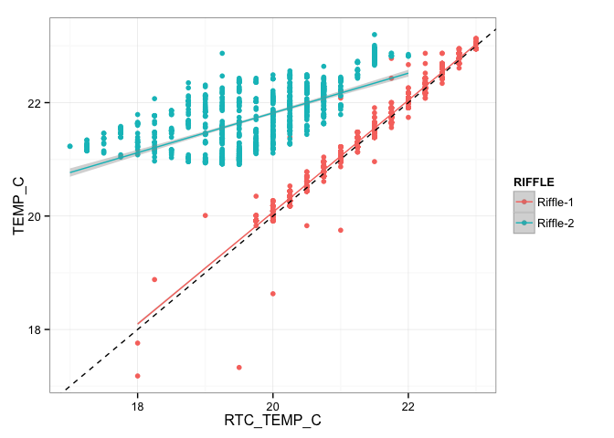
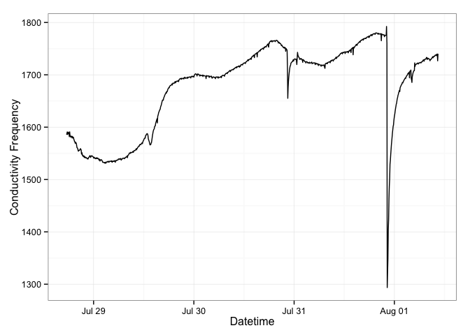
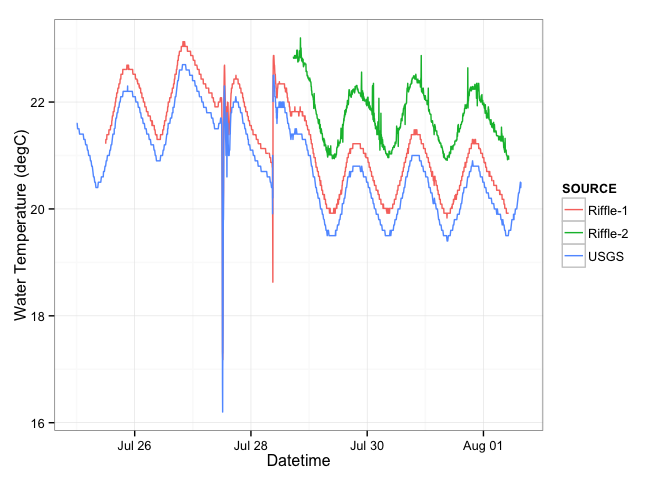
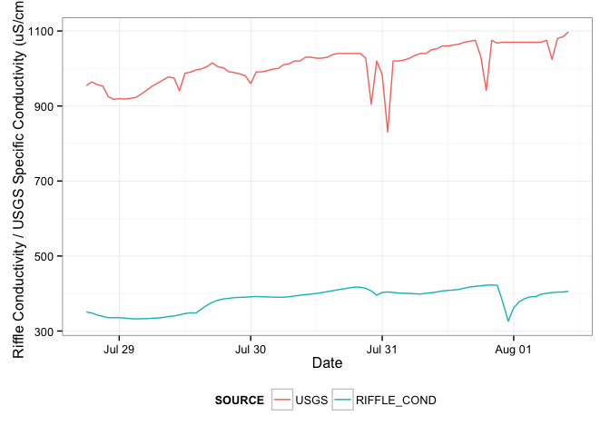
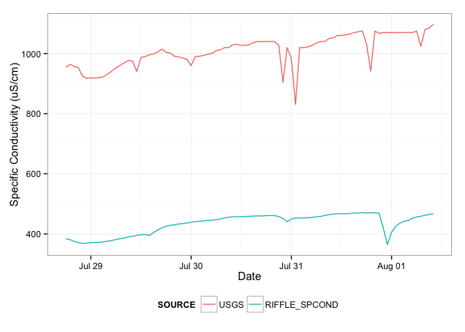
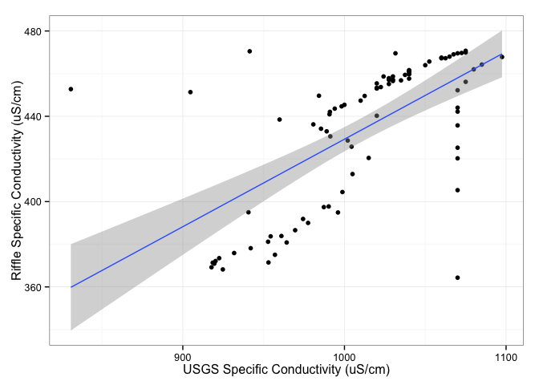
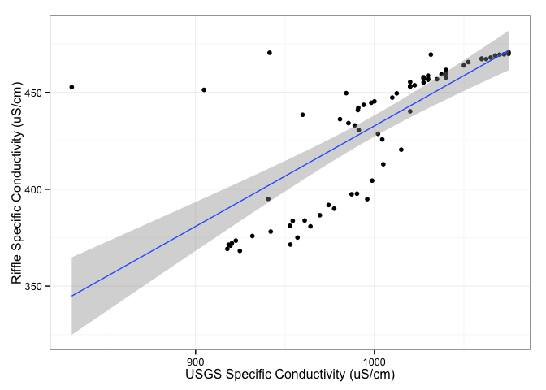
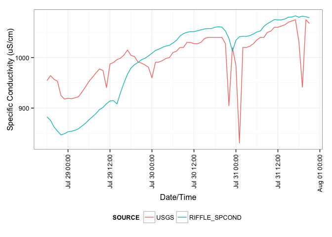
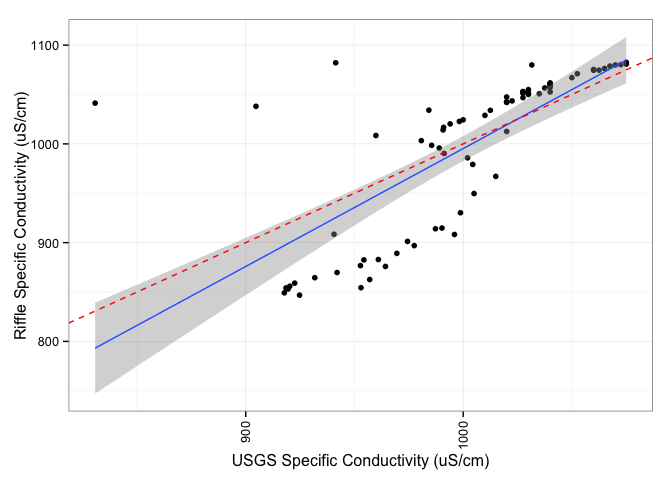

# Riffle-ito Cambridge Deployment
Jeff Walker & Don Blair  
August 1, 2014  

This document summarizes data collected by two [Riffle-ito Water Quality Data Loggers](https://github.com/p-v-o-s/riffle-ito) deployed at USGS streamflow gage [01104455](http://waterdata.usgs.gov/ma/nwis/uv/?site_no=01104455) on Stony Brook in Waltham, MA.

**Purpose**: The first field test of a riffle-ito for temperature, conductivity, and light levels. The riffle-itos were deployed at the location of a USGS streamflow gage for verification.

**Location**: Stony Brook in Waltham, MA 

**Public Lab Note**: See the [Public Lab Research Note](http://publiclab.org/notes/donblair/08-01-2014/first-riffle-deployment-city-of-cambridge-water-department) for more photos and descriptions

**Change Log**:

- 2014-08-02: Add Detailed Conductivity Analysis section at the bottom where 555 frequencies are converted to uS/cm and adjusted for temperature to compute specific conductivity.

# Set Up

First load the R packages used for this summary.


```r
library(lubridate)
library(dplyr)
library(tidyr)
library(stringr)
library(ggplot2)
theme_set(theme_bw())
```

# Load Data

The raw data are stored in the `./data` directory. There are multiple files for this 
deployment, one file per riffle-ito. The two files have different columns because Riffle 1 only measured temperature, and Riffle 2 measured temperature, conductivity, and light levels.


```r
riffle1 <- read.csv('./data/riffle1Deploy.CSV', as.is=TRUE)
riffle2 <- read.csv('./data/riffle2Deploy.CSV', as.is=TRUE)
head(riffle1)
```

```
##              DATETIME RTC_TEMP_C TEMP_C BATTERY_LEVEL
## 1 2014-07-25 10:40:55      34.00  29.26          7.38
## 2 2014-07-25 10:46:00      40.00  31.01          7.39
## 3 2014-07-25 10:51:05      34.75  24.88          7.40
## 4 2014-07-25 10:56:09      25.75  21.30          7.40
## 5 2014-07-25 11:01:13      23.75  22.08          7.40
## 6 2014-07-25 11:06:16      23.00  21.22          7.40
```

```r
head(riffle2)
```

```
##   DATETIME_UNIX        DATETIME_REG RTC_TEMP_C TEMP_C CONDUCT_FREQ_HERTZ
## 1    1406565979 2014-07-28 16:46:19      30.75  31.15               0.08
## 2    1406566281 2014-07-28 16:51:21      31.50  31.60               0.32
## 3    1406566583 2014-07-28 16:56:23      31.75  31.58               0.32
## 4    1406566884 2014-07-28 17:01:24      29.25  27.33               0.32
## 5    1406567186 2014-07-28 17:06:26      27.00  23.62             991.36
## 6    1406567486 2014-07-28 17:11:26      24.50  23.08            1602.73
##   PHOTORESIST BATTERY_LEVEL
## 1         895           744
## 2         871           744
## 3         848           744
## 4         817           743
## 5          33           744
## 6          64           744
```

Next, parse the datetimes using `lubridate::ymd_hms()` to `POSIXct` objects and assign an ID to each dataset. 

Increase the battery level readings for Riffle-1 by a factor of 100 due a mistake in the original sketch that reduced the recorded values by 100 before writing to the SD card.

Also filter the data in each dataset to exclude the first and last few readings of each deployment when each riffle-ito was in the air. 


```r
riffle1 <- mutate(riffle1,
                  DATETIME=ymd_hms(DATETIME),
                  RIFFLE='Riffle-1',
                  BATTERY_LEVEL=BATTERY_LEVEL*100) %>%
    filter(DATETIME >= ymd_hm("2014-07-25 12:00"),
           DATETIME <= ymd_hm("2014-08-01 10:30"))
riffle2 <- mutate(riffle2,
                  DATETIME_REG=ymd_hms(DATETIME_REG),
                  RIFFLE='Riffle-2') %>%
    filter(DATETIME_REG >= ymd_hm("2014-07-28 17:30"),
           DATETIME_REG <= ymd_hm("2014-08-01 10:30"))
```

For plotting, it will be easier to convert the datasets to a long format first. This can easily be done using the `tidyr::gather` function.


```r
riffle1 <- gather(riffle1, VAR, VALUE, RTC_TEMP_C:BATTERY_LEVEL)
riffle2 <- mutate(riffle2, DATETIME=DATETIME_REG) %>%
  select(-DATETIME_UNIX, -DATETIME_REG) %>%
  gather(VAR, VALUE, RTC_TEMP_C, TEMP_C, 
         CONDUCT_FREQ_HERTZ, PHOTORESIST, BATTERY_LEVEL)
df <- rbind(riffle1, riffle2) %>%
  mutate(RIFFLE=factor(RIFFLE))
summary(df)
```

```
##     DATETIME                        RIFFLE                     VAR      
##  Min.   :2014-07-25 12:01:49   Riffle-1:5937   RTC_TEMP_C        :3048  
##  1st Qu.:2014-07-28 18:06:29   Riffle-2:5345   TEMP_C            :3048  
##  Median :2014-07-29 23:34:04                   BATTERY_LEVEL     :3048  
##  Mean   :2014-07-29 17:36:08                   CONDUCT_FREQ_HERTZ:1069  
##  3rd Qu.:2014-07-31 04:59:44                   PHOTORESIST       :1069  
##  Max.   :2014-08-01 10:26:23                                            
##      VALUE       
##  Min.   :   0.0  
##  1st Qu.:  20.8  
##  Median :  22.2  
##  Mean   : 366.8  
##  3rd Qu.: 707.0  
##  Max.   :1792.4
```

The data are now in long format with each row corresponding to one measurement for a single variable.

# Riffle Data Plots

This figures shows the raw data of both riffle-ito deployments. The data are colored by the corresponding file/deployment. 


```r
ggplot(df, aes(DATETIME, VALUE, color=RIFFLE)) +
  geom_line() +
  facet_wrap(~VAR, scales='free_y') +
  labs(x='Datetime', y='Value') +
  theme(axis.text.x=element_text(angle=90, hjust=1, vjust=0.5),
        legend.position='top')
```

 

## Temperature Sensor

Although both riffle-itos were deployed at the same location, they showed significant differences in temperature. The primary issue seems to be with Riffle-2 due to the differences between the on-board RTC temperature (`RTC_TEMP_C`) and the thermister temperature (`TEMP_C`). 

The following figure plots `TEMP_C` vs `RTC_TEMP_C` for both riffles. The dashed black line is a 1:1 line of equality, the other lines are linear regressions for each riffle-ito. Riffle-1 shows very good agreement between the RTC and thermister temperatures, while Riffle-2 shows poor agreement but some positive relationship.


```r
spread(df, VAR, VALUE) %>%
  ggplot(aes(RTC_TEMP_C, TEMP_C, color=RIFFLE)) +
  geom_point() +
  geom_abline(color='black', linetype=2) +
  geom_smooth(method='lm')
```

 

The differences between the RTC and thermister temperatures indicate an ir-regular bias for Riffle-2.


```r
spread(df, VAR, VALUE) %>%
  ggplot(aes(DATETIME, RTC_TEMP_C-TEMP_C, color=RIFFLE)) +
  geom_point() +
  labs(x="Datetime")
```

 

As another comparison, we can plot timeseries of the RTC and thermister temperatures on the same figure, with each panel corresponding to one riffle-ito. This again shows the close agreement for Riffle-1 but not Riffle-2.


```r
filter(df, VAR %in% c("RTC_TEMP_C", "TEMP_C")) %>%
ggplot(aes(DATETIME, VALUE, color=VAR)) +
  geom_line() +
  facet_wrap(~RIFFLE, ncol=1)
```

 

## Light Sensor

Riffle-2 included a photoresistor for recording light levels. This figure shows a time series of the light level data, the units of which are ohms(?). This shows a clear diurnal signal, as expected.


```r
filter(df, VAR=='PHOTORESIST') %>%
  ggplot(aes(DATETIME, VALUE)) +
  geom_line() +
  labs(x='Datetime', y='Photoresistor')
```

 

We can also see the diurnal signal by plotting these data by time of day (in decimal hours), with each line colored by the date. This shows that the highest light levels occurred around 14:00 on 2014-07-29.


```r
filter(df, VAR=='PHOTORESIST') %>%
  mutate(DATE=factor(floor_date(DATETIME, unit='day')),
         DECIMAL_TIME=hour(DATETIME)+minute(DATETIME)/60) %>%
  ggplot(aes(DECIMAL_TIME, VALUE, color=DATE)) +
  geom_line() +
  labs(x='Time of Day', y='Photoresistor')
```

 

## Conductivity Sensor

Riffle-2 also included a conductivity sensor. This figure shows the timeseries of the conductivity measurements. 

The pattern of this timeseries indicates that conductivity increased for the first few days, but quickly dropped the night of July 31, which indicates a possible rain storm that would have diluted the streamflow.


```r
filter(df, VAR=='CONDUCT_FREQ_HERTZ') %>%
  ggplot(aes(DATETIME, VALUE)) +
  geom_line() +
  labs(x='Datetime', y='Conductivity Frequency')
```

 

# Verification against USGS Gage

Station: [01104455 STONY BROOK, UNNAMED TRIBUTARY 1, NEAR WALTHAM, MA](http://waterdata.usgs.gov/ma/nwis/uv/?site_no=01104455)

[Data File Source](http://waterdata.usgs.gov/ma/nwis/uv?cb_00060=on&cb_00010=on&cb_00095=on&cb_63680=on&cb_99404=on&format=rdb&site_no=01104455&period=&begin_date=2014-07-25&end_date=2014-08-01)

The two riffle-itos were deployed at a USGS gage that provides continuous measurements of temperature and conductivity for verifying the riffle-ito data.

First we load the data from a text file.


```r
usgs <- read.table('./data/01104455_20140725.txt', sep='\t', skip=30)
names(usgs) <- c('AGENCY', 'STATION_ID', 'DATETIME', 'TIMEZONE', 'FLOW', 'FLOW_FLAG', 'TEMP_C', 'TEMP_FLAG', 'SPCOND', 'SPCOND_FLAG', 'TURB', 'TURB_FLAG', 'CHLORIDE', 'CHLORIDE_FLAG')
usgs <- select(usgs, DATETIME, FLOW, TEMP_C, SPCOND, TURB, CHLORIDE) %>%
  mutate(DATETIME=ymd_hm(DATETIME))
head(usgs)
```

```
##              DATETIME FLOW TEMP_C SPCOND TURB CHLORIDE
## 1 2014-07-25 00:00:00 0.25   21.6   1210  1.0      320
## 2 2014-07-25 00:15:00 0.25   21.6   1210  1.0      320
## 3 2014-07-25 00:26:00 0.25   21.5     NA  1.0       NA
## 4 2014-07-25 00:27:00 0.25   21.5   1200  1.0      320
## 5 2014-07-25 00:30:00 0.25   21.5   1210  1.0      320
## 6 2014-07-25 00:45:00 0.25   21.5   1210  0.5      320
```

Then convert this data frame to a long format.


```r
usgs <- gather(usgs, VAR, VALUE, FLOW:CHLORIDE)
```

Plot USGS timeseries


```r
ggplot(usgs, aes(DATETIME, VALUE)) +
  geom_line() +
  facet_wrap(~VAR, scales='free_y')
```

 

## Temperature Verification

This figure plots the water temperature recorded by each riffle-ito and by the USGS gage. The Riffle-1 data show very strong agreement with the USGS gage although there is a consistent bias. The Riffle-2 temperature data show a greater bias, but also show a similar pattern.


```r
riffle.temp <- filter(df, VAR=="TEMP_C") %>%
  mutate(SOURCE=RIFFLE) %>%
  select(DATETIME, SOURCE, VAR, VALUE)
usgs.temp <- filter(usgs, VAR=="TEMP_C") %>%
  mutate(SOURCE='USGS') %>%
  select(DATETIME, SOURCE, VAR, VALUE)
temp <- rbind(riffle.temp, usgs.temp)
ggplot(temp, aes(DATETIME, VALUE, color=SOURCE)) +
  geom_line() +
  labs(x="Datetime", y="Water Temperature (degC)")
```

 

The following figure shows a scatter plot of each riffle-ito against the USGS gage. Because each riffle-ito and the USGS gage collected measurements at different times, the data are averaged by hour first and then plotted (i.e. this figure compares hourly average temperature values). 

The dashed black line in this figure is a 1:1 line of equality, while the colored lines are linear regressions between each riffle-ito and the USGS gage. 


```r
temp.compare <- mutate(temp, 
       DATEHOUR=round_date(DATETIME, unit='hour'),
       SOURCE = str_replace_all(SOURCE, '-', '_')) %>%
  group_by(DATEHOUR, SOURCE, VAR) %>%
  summarize(VALUE=mean(VALUE, na.rm=TRUE)) %>%
  spread(SOURCE, VALUE) %>%
  gather(RIFFLE, VALUE, Riffle_1:Riffle_2) %>%
  filter(!is.na(VALUE))

temp.compare %>%
  ggplot(aes(USGS, VALUE, color=RIFFLE)) +
  geom_point() +
  geom_smooth(method='lm') +
  geom_abline(color='black', linetype=2)
```

 

The following code summarizes a linear regression between the Riffle-1 and USGS temperature data. Note that one data point is excluded as an outlier (USGS=18.95, Riffle-1=20.59) as this point exhibits strong influence on the regression.


```r
lm.riffle_1 <- filter(temp.compare, RIFFLE=="Riffle_1", USGS >= 19) %>%
  lm(VALUE ~ USGS, data=.)
summary(lm.riffle_1)
```

```
## 
## Call:
## lm(formula = VALUE ~ USGS, data = `filter(temp.compare, RIFFLE == "Riffle_1", USGS >= 19)`)
## 
## Residuals:
##     Min      1Q  Median      3Q     Max 
## -0.7720 -0.0129  0.0007  0.0177  0.2284 
## 
## Coefficients:
##             Estimate Std. Error t value Pr(>|t|)    
## (Intercept)  0.79049    0.12455    6.35  2.1e-09 ***
## USGS         0.98208    0.00595  164.99  < 2e-16 ***
## ---
## Signif. codes:  0 '***' 0.001 '**' 0.01 '*' 0.05 '.' 0.1 ' ' 1
## 
## Residual standard error: 0.0669 on 164 degrees of freedom
## Multiple R-squared:  0.994,	Adjusted R-squared:  0.994 
## F-statistic: 2.72e+04 on 1 and 164 DF,  p-value: <2e-16
```

The linear regression reports a slope of 0.98 and an intercept of 0.79. The slope is very close to unity indicating that the Riffle-1 dataset simply shows a constant bias of 0.79 degC, which could be corrected by calibration.

The following is output from another linear regression of Riffle-2 against the USGS temperature data.


```r
lm.riffle_2 <- filter(temp.compare, RIFFLE=="Riffle_2") %>%
  lm(VALUE ~ USGS, data=.)
summary(lm.riffle_2)
```

```
## 
## Call:
## lm(formula = VALUE ~ USGS, data = `filter(temp.compare, RIFFLE == "Riffle_2")`)
## 
## Residuals:
##      Min       1Q   Median       3Q      Max 
## -0.10965 -0.03519 -0.00458  0.03158  0.18376 
## 
## Coefficients:
##             Estimate Std. Error t value Pr(>|t|)    
## (Intercept)   2.5028     0.2128    11.8   <2e-16 ***
## USGS          0.9493     0.0105    90.5   <2e-16 ***
## ---
## Signif. codes:  0 '***' 0.001 '**' 0.01 '*' 0.05 '.' 0.1 ' ' 1
## 
## Residual standard error: 0.0543 on 87 degrees of freedom
## Multiple R-squared:  0.989,	Adjusted R-squared:  0.989 
## F-statistic: 8.19e+03 on 1 and 87 DF,  p-value: <2e-16
```

The linear regression reports a slope of 0.95 and an intercept of 2.5. Again, the slope is very close to unity, however the bias is greater at 2.5 degC, which could also be corrected by calibration.

## Conductivity Verification

Although the riffle-ito conductivity measurements are not reported in standard units (e.g. uS/cm) and are not temperature corrected, they can still be compared to the USGS measurements. 

This figure shows the Riffle and USGS conductivity data. Note that the units are not the same, but both lines show somewhat similar patterns. However, the dilution event on the night of July 31 is not reflected in the USGS dataset.


```r
riffle.cond <- filter(df, VAR=="CONDUCT_FREQ_HERTZ") %>%
  mutate(SOURCE='RIFFLE') %>%
  select(DATETIME, SOURCE, VAR, VALUE)
usgs.cond <- filter(usgs, VAR=="SPCOND", DATETIME>=min(riffle.cond$DATETIME),
                    DATETIME<=max(riffle.cond$DATETIME)) %>%
  mutate(SOURCE='USGS') %>%
  select(DATETIME, SOURCE, VAR, VALUE)
cond <- rbind(riffle.cond, usgs.cond)
ggplot(cond, aes(DATETIME, VALUE, color=SOURCE)) +
  geom_line() +
  labs(x="Datetime", y="Conductivity Freq (Riffle) / Sp. Conductivity (USGS)")
```

 

This figure shows a scatterplot between conductivity measured by USGS and the Riffle. As with temperature, this comparison uses hourly average values since the USGS and the Riffle collected measurements at different time intervals.


```r
cond.hr <- mutate(cond, DATEHOUR=round_date(DATETIME, unit='hour')) %>%
  group_by(DATEHOUR, SOURCE, VAR) %>%
  summarise(N=n(), VALUE=mean(VALUE, na.rm=TRUE)) %>%
  select(-VAR, -N) %>%
  spread(SOURCE, VALUE)
ggplot(cond.hr, aes(USGS, RIFFLE)) +
  geom_point() +
  geom_smooth(method='lm')
```

 

We can also color the data points by temperature to see if a temperature correction may improve the fit in conductivity values. This figure suggests that some of the data points with greater errors have higher temperature, although it's not very definitive.


```r
usgs.temp.hr <- group_by(usgs.temp, DATEHOUR=round_date(DATETIME, unit='hour')) %>%
  group_by(DATEHOUR) %>%
  summarise(TEMP=mean(VALUE, na.rm=TRUE))
cond.temp.hr <- merge(cond.hr, usgs.temp.hr, by='DATEHOUR', all.x=TRUE)
ggplot(cond.temp.hr, aes(USGS, RIFFLE, color=TEMP)) +
  geom_point() +
  geom_smooth(method='lm') +
  scale_color_gradient(low='steelblue', high='orangered')
```

 

# Detailed Conductivity Analysis

The conductivity measurements collected by the Riffle are actually frequency measurements generated by a 555 timer. The equation for converting conductivity of water ($S_{water}$) to frequency ($f$) is:

$$f = \frac{1}{0.7\left(R_A + \frac{2}{S_{water}} \frac{l}{A} \right)C} $$

where $f$ is the frequency measured by the 555 timer (Hz), $R_A$ is the resistance of the circuit series resistor ($\Omega$), $S_{water}$ is the conductivity of the water (S/m), $l$ is the distance between the electrodes (m), $A$ is the surface area of the electrodes (m$^2$), and $C$ is the capacitance of the circuit capacitor (F).

Solving for $S_{water}$ gives an equation for computing the water conductivity based on the measured frequency ($f$).

$$ S_{water} = \frac{2\left(\frac{l}{A}\right)}{\frac{1}{0.7fC} - R_A}$$

For this deployment, the values of the circuit resistor and capacitor were $R_A = 3,300$ $\Omega$ and $C = 1e-7$ F (or $0.1 \mu$F), respectively. The electrodes were screws extruding from the cap of a water bottle, but we'll assume the ratio of $l/A = 1 \text{ cm}^{-1}$.

Using these values and this equation, we can thus convert the frequency measurements to units of conductivity ($\mu$S/cm).


```r
R_A <- 3300  # ohm
C <- 1e-7    # F
l_A <- 1*100 # 1/cm * 100 cm/m -> 100/m
cond.temp.hr <- mutate(cond.temp.hr,
                       RIFFLE_COND = 2*l_A/(1/(0.7*RIFFLE*C) - R_A), # S/m
                       RIFFLE_COND = RIFFLE_COND * 1e6 / 1e2)        # S/m * 1e6 uS/S * m/1e2 cm -> uS/cm
```

Now if we plot the riffle-ito conductivity in uS/cm against the USGS measurements, we find that the riffle-ito is much lower. However, this is not surprising as the values for $l$ and $A$ are very uncertain and require calibration.


```r
select(cond.temp.hr, DATEHOUR, USGS, RIFFLE_COND) %>%
  gather(SOURCE, VALUE, USGS:RIFFLE_COND) %>%
ggplot(aes(DATEHOUR, VALUE, color=SOURCE)) +
  geom_line()
```

 

We also need to correct for temperature using the equation:

$$ S_{25} = \frac{S_T}{1 + \alpha(T-25)} $$

where $S_{25}$ is the specific conductivity at 25 degC (which is reported by USGS), $S_T$ is the conductivity at temperature $T$, and $\alpha$ is a temperature correction factor, which is typically about 0.024 1/degC.

Using this equation we can convert the riffle-ito conductivity to specific conductivity at 25 degC using the USGS temperatures.


```r
alpha <- 0.024
cond.temp.hr <- mutate(cond.temp.hr,
                       RIFFLE_SPCOND = RIFFLE_COND / (1 + alpha*(TEMP-25)))
```

Now, again plot the Riffle data converted to specific conductivity at 25 degC against the USGS data.


```r
select(cond.temp.hr, DATEHOUR, USGS, RIFFLE_SPCOND) %>%
  gather(SOURCE, VALUE, USGS:RIFFLE_SPCOND) %>%
ggplot(aes(DATEHOUR, VALUE, color=SOURCE)) +
  geom_line()
```

 

If we plot these values against each other as a scatter plot, we start to find a closer relationship. The line is a linear regression model between the two. 


```r
ggplot(cond.temp.hr, aes(USGS, RIFFLE_SPCOND)) +
  geom_point() + 
  geom_smooth(method='lm')
```

 

If we exclude the data colelcted after 2014-07-29 10:00 when the riffle indicates an unexplained dilution event then we start to see a much closer relationship. This dilution event may have been caused by an air bubble or debris being trapped between the two electrodes. 


```r
filter(cond.temp.hr, DATEHOUR <= ymd_hm("2014-07-29 22:00")) %>%
ggplot(aes(USGS, RIFFLE_SPCOND)) +
  geom_point() + 
  geom_smooth(method='lm')
```

 

The above figure shows that the USGS measurements are about 2-3 times higher than the riffle-ito. However, this could be explained by the unknown values of $l$ and $A$. If we adjust the ration of $l/A$ to try and reduce the error between the USGS and riffle-ito data, we can actually achieve a close fit. By manually adjustment, I found a ratio of $l/A=2.5$ 1/cm produces a reasonable fit. This higher value of $l/A$ makes sense since the surface area of the electrodes are the edges of two screws, which likely have an area less than 1 cm$^2$, but are still placed about 1 cm apart (see [this photo](http://i.publiclab.org/system/images/photos/000/005/741/original/IMG_0343.JPG). So this seems reasonable.


```r
R_A <- 3300  # ohm
C <- 1e-7    # F
l_A <- 2.5*100 # 1/cm * 100 cm/m -> 100/m
alpha <- 0.024
cond.temp.hr.adjust <- filter(cond.temp.hr, DATEHOUR <= ymd_hm("2014-07-29 22:00")) %>%
   mutate(RIFFLE_COND = 2*l_A/(1/(0.7*RIFFLE*C) - R_A),
          RIFFLE_COND = RIFFLE_COND * 1e6 / 1e2,
          RIFFLE_SPCOND = RIFFLE_COND / (1 + alpha*(TEMP-25)))
```

Plotting the time series:


```r
select(cond.temp.hr.adjust, DATEHOUR, USGS, RIFFLE_SPCOND) %>%
  gather(SOURCE, VALUE, USGS:RIFFLE_SPCOND) %>%
  ggplot(aes(DATEHOUR, VALUE, color=SOURCE)) +
    geom_line()
```

 

And the scatter plot:


```r
ggplot(cond.temp.hr.adjust, aes(USGS, RIFFLE_SPCOND)) +
  geom_point() + 
  geom_smooth(method='lm') +
  geom_abline(color='red', linetype=2)
```

 

If we run a linear model on between the Riffle and USGS SpCond values, we get:


```r
lm.spcond <- lm(RIFFLE_SPCOND ~ USGS, data=cond.temp.hr.adjust)
summary(lm.spcond)
```

```
## 
## Call:
## lm(formula = RIFFLE_SPCOND ~ USGS, data = cond.temp.hr.adjust)
## 
## Residuals:
##    Min     1Q Median     3Q    Max 
## -41.51 -22.47  -5.24  11.93  71.96 
## 
## Coefficients:
##             Estimate Std. Error t value Pr(>|t|)    
## (Intercept) -421.145    180.489   -2.33    0.027 *  
## USGS           1.456      0.187    7.78  2.3e-08 ***
## ---
## Signif. codes:  0 '***' 0.001 '**' 0.01 '*' 0.05 '.' 0.1 ' ' 1
## 
## Residual standard error: 30.6 on 27 degrees of freedom
## Multiple R-squared:  0.692,	Adjusted R-squared:  0.68 
## F-statistic: 60.6 on 1 and 27 DF,  p-value: 2.28e-08
```

This model has an $R^2 = 0.692$, which is not too bad considering there was no calibration and only the adjustment of a single parameter (the ratio of $l/A$).

Removing the data after July 29 14:00 would greatly improve this fit, however, this does not seem justified. But just out of curiosity, I'll include it anyway.


```r
filter(cond.temp.hr.adjust, DATEHOUR <= ymd_hm("2014-07-29 14:00")) %>%
ggplot(aes(USGS, RIFFLE_SPCOND)) +
  geom_point() + 
  geom_smooth(method='lm') +
  geom_abline(color='red', linetype=2)
```

 

And the linear model:


```r
lm.spcond2 <- filter(cond.temp.hr.adjust, DATEHOUR <= ymd_hm("2014-07-29 14:00")) %>%
  lm(RIFFLE_SPCOND ~ USGS, data=.)
summary(lm.spcond2)
```

```
## 
## Call:
## lm(formula = RIFFLE_SPCOND ~ USGS, data = `filter(cond.temp.hr.adjust, DATEHOUR <= ymd_hm("2014-07-29 14:00"))`)
## 
## Residuals:
##    Min     1Q Median     3Q    Max 
## -26.29  -2.84  -0.16   3.23  42.78 
## 
## Coefficients:
##             Estimate Std. Error t value Pr(>|t|)    
## (Intercept)  168.591    113.716    1.48     0.15    
## USGS           0.825      0.120    6.90  1.4e-06 ***
## ---
## Signif. codes:  0 '***' 0.001 '**' 0.01 '*' 0.05 '.' 0.1 ' ' 1
## 
## Residual standard error: 13.6 on 19 degrees of freedom
## Multiple R-squared:  0.715,	Adjusted R-squared:   0.7 
## F-statistic: 47.7 on 1 and 19 DF,  p-value: 1.39e-06
```

So this does indeed increase the $R^2$ to 0.715. But again, this is not totally justified.

# Conclusions

Based on this analysis, we conclude:

- Both riffles were able to withstand a multi-day deployment in the field. 
- The temperature measurements by Riffle-1 show very strong agreement with the USGS gage with a consistent bias < 0.5 degC. 
- The conductivity measurements do not agree as well with the USGS gage, although the differences between the RTC and thermister temperatures measured by Riffle-2 (which also measured the conductivity) suggest something may have been wrong.
- The light levels show expected diurnal patterns, and could be compared to data on cloud cover to see if cloudy days resulted in lower light levels.
- By converting the frequency measurements reported by the Riffle 555 timer to units of $\mu$S/cm, adjusting for temperature to compute specific conductivity, and manually adjusting the geometric dimensions of the electrodes ($l/A$), we can achieve a reasonable fit between the specific conductivity measurements from the USGS and the riffle-ito measurements ($R^2 = 0.692$). 
