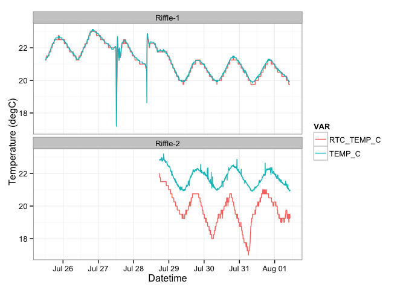

# Riffle-ito Cambridge Deployment
Jeff Walker & Don Blair  
August 1, 2014  

This document summarizes data collected by two [Riffle-ito Water Quality Data Loggers](https://github.com/p-v-o-s/riffle-ito) deployed at a USGS streamflow gage in .

**Purpose**: To determine the stability and battery-lifetime of a single riffle-ito deployment, and to compare the on-board RTC temperature measurements to the DHT22 measurements.

**Description**: The riffle-ito was configured with the sketch above and set to record readings from a DHT22 temperature/humidity sensor every 60 seconds. Three fresh Duracell AA batteries were used to power the riffle-ito. Data were retrieved every few days resulting in short gaps and multiple data files, however the batteries were not changed.  

**Location**: 

## Set Up

First we'll load the R packages used for this summary.


```r
library(lubridate)
library(dplyr)
library(tidyr)
library(ggplot2)
theme_set(theme_bw())
```

## Load Data

The raw data are stored in the `./data` directory. There are multiple files for this 
deployment because I temporarily removed the SD card from the riffle-ito to download
the data. As shown in the [sketch](), whenever the riffle-ito is powered on, it creates a new logging file by incrementing the last two digits by one.


```r
riffle1 <- read.csv('./data/riffle1Deploy.CSV', as.is=TRUE)
riffle2 <- read.csv('./data/riffle2Deploy.CSV', as.is=TRUE)
head(riffle1)
```

```
##              DATETIME RTC_TEMP_C TEMP_C BATTERY_LEVEL
## 1 2014-07-25 10:40:55      34.00  29.26          7.38
## 2 2014-07-25 10:46:00      40.00  31.01          7.39
## 3 2014-07-25 10:51:05      34.75  24.88          7.40
## 4 2014-07-25 10:56:09      25.75  21.30          7.40
## 5 2014-07-25 11:01:13      23.75  22.08          7.40
## 6 2014-07-25 11:06:16      23.00  21.22          7.40
```

```r
head(riffle2)
```

```
##   DATETIME_UNIX        DATETIME_REG RTC_TEMP_C TEMP_C CONDUCT_FREQ_HERTZ
## 1    1406565979 2014-07-28 16:46:19      30.75  31.15               0.08
## 2    1406566281 2014-07-28 16:51:21      31.50  31.60               0.32
## 3    1406566583 2014-07-28 16:56:23      31.75  31.58               0.32
## 4    1406566884 2014-07-28 17:01:24      29.25  27.33               0.32
## 5    1406567186 2014-07-28 17:06:26      27.00  23.62             991.36
## 6    1406567486 2014-07-28 17:11:26      24.50  23.08            1602.73
##   PHOTORESIST BATTERY_LEVEL
## 1         895           744
## 2         871           744
## 3         848           744
## 4         817           743
## 5          33           744
## 6          64           744
```

Next, we want to parse the datetimes using `lubridate::ymd_hms()` to `POSIXct` objects.


```r
riffle1 <- mutate(riffle1,
                  DATETIME=ymd_hms(DATETIME),
                  RIFFLE='Riffle-1',
                  BATTERY_LEVEL=BATTERY_LEVEL*100)
riffle2 <- mutate(riffle2,
                  DATETIME_REG=ymd_hms(DATETIME_REG),
                  RIFFLE='Riffle-2')
summary(riffle1)
```

```
##     DATETIME                     RTC_TEMP_C       TEMP_C     BATTERY_LEVEL
##  Min.   :2014-07-25 10:40:55   Min.   :18.0   Min.   :17.2   Min.   :667  
##  1st Qu.:2014-07-27 05:58:26   1st Qu.:20.5   1st Qu.:20.6   1st Qu.:691  
##  Median :2014-07-29 01:14:36   Median :21.2   Median :21.3   Median :702  
##  Mean   :2014-07-29 01:13:30   Mean   :21.5   Mean   :21.5   Mean   :705  
##  3rd Qu.:2014-07-30 20:28:54   3rd Qu.:22.0   3rd Qu.:22.2   3rd Qu.:716  
##  Max.   :2014-08-01 15:44:01   Max.   :40.0   Max.   :36.0   Max.   :740  
##     RIFFLE         
##  Length:2058       
##  Class :character  
##  Mode  :character  
##                    
##                    
## 
```

```r
summary(riffle2)
```

```
##  DATETIME_UNIX       DATETIME_REG                   RTC_TEMP_C  
##  Min.   :1.41e+09   Min.   :2014-07-28 16:46:19   Min.   :17.0  
##  1st Qu.:1.41e+09   1st Qu.:2014-07-29 16:32:12   1st Qu.:19.2  
##  Median :1.41e+09   Median :2014-07-30 16:16:44   Median :20.0  
##  Mean   :1.41e+09   Mean   :2014-07-30 16:16:41   Mean   :20.3  
##  3rd Qu.:1.41e+09   3rd Qu.:2014-07-31 16:01:04   3rd Qu.:20.8  
##  Max.   :1.41e+09   Max.   :2014-08-01 15:47:37   Max.   :36.2  
##      TEMP_C     CONDUCT_FREQ_HERTZ  PHOTORESIST    BATTERY_LEVEL
##  Min.   :20.9   Min.   :   0.1     Min.   :  0.0   Min.   :701  
##  1st Qu.:21.3   1st Qu.:1573.9     1st Qu.:  0.0   1st Qu.:709  
##  Median :21.8   Median :1698.9     Median : 21.0   Median :717  
##  Mean   :22.1   Mean   :1580.9     Mean   : 70.1   Mean   :719  
##  3rd Qu.:22.2   3rd Qu.:1731.0     3rd Qu.: 97.8   3rd Qu.:730  
##  Max.   :36.4   Max.   :1792.4     Max.   :945.0   Max.   :744  
##     RIFFLE         
##  Length:1142       
##  Class :character  
##  Mode  :character  
##                    
##                    
## 
```

The data are currently in a wide format, where each column represents a single variable (see [Tidy Data](http://vita.had.co.nz/papers/tidy-data.pdf) and [Reshaping Data with the reshape Package](http://www.jstatsoft.org/v21/i12/paper) by Hadley Wickham for more information about long/wide formats, and note that `tidyr` is a relatively new package that provides much of the same functionality as the `reshape2` package). 

For plotting, it will be easier to convert to a long format. This can easily be done using the `tidyr::gather` function.


```r
riffle1 <- gather(riffle1, VAR, VALUE, RTC_TEMP_C:BATTERY_LEVEL) %>%
  filter(DATETIME >= ymd_hm("2014-07-25 12:00"),
         DATETIME <= ymd_hm("2014-08-01 10:30"))
riffle2 <- mutate(riffle2, DATETIME=DATETIME_REG) %>%
  dplyr::select(-DATETIME_UNIX, -DATETIME_REG) %>%
  gather(VAR, VALUE, RTC_TEMP_C, TEMP_C, 
         CONDUCT_FREQ_HERTZ, PHOTORESIST, BATTERY_LEVEL) %>%
  filter(DATETIME >= ymd_hm("2014-07-28 17:30"),
         DATETIME <= ymd_hm("2014-08-01 10:30"))
df <- rbind(riffle1, riffle2) %>%
  mutate(RIFFLE=factor(RIFFLE))
summary(df)
```

```
##     DATETIME                        RIFFLE                     VAR      
##  Min.   :2014-07-25 12:01:49   Riffle-1:5937   RTC_TEMP_C        :3048  
##  1st Qu.:2014-07-28 18:06:29   Riffle-2:5345   TEMP_C            :3048  
##  Median :2014-07-29 23:34:04                   BATTERY_LEVEL     :3048  
##  Mean   :2014-07-29 17:36:08                   CONDUCT_FREQ_HERTZ:1069  
##  3rd Qu.:2014-07-31 04:59:44                   PHOTORESIST       :1069  
##  Max.   :2014-08-01 10:26:23                                            
##      VALUE       
##  Min.   :   0.0  
##  1st Qu.:  20.8  
##  Median :  22.2  
##  Mean   : 366.8  
##  3rd Qu.: 707.0  
##  Max.   :1792.4
```

The data are now in long format with each row corresponding to one measurement for a single variable.

## Visualizations

We can plot the data with each panel showing one of the variables. The data are colored by the corresponding file/deployment. 


```r
ggplot(df, aes(DATETIME, VALUE, color=RIFFLE)) +
  geom_line() +
  facet_wrap(~VAR, scales='free_y') +
  labs(x='Datetime', y='Value') +
  theme(axis.text.x=element_text(angle=90, hjust=1, vjust=0.5),
        legend.position='top')
```

 

Both Riffle-itos were extracted from the field around 2014-08-01 10:30 AM so we'll drop all data after that. 

We can compare the RTC on-board temperature to the DHT22 temperature for verification. The red line in this figure is a 1:1 line of equality; the blue line is a linear regression. This figure shows that the DHT22 temperature (`TEMP_C`) tends to be about 0.5 degC greater than the RTC temperature (`RTC_TEMP_C`).


```r
spread(df, VAR, VALUE) %>%
  ggplot(aes(RTC_TEMP_C, TEMP_C, color=RIFFLE)) +
  geom_point() +
  geom_abline(color='red', linetype=2) +
  geom_smooth(method='lm')
```

 

THe differences between the RTC and DHT22 temperature show an interesting (i.e. non-regular) pattern over time.


```r
spread(df, VAR, VALUE) %>%
  ggplot(aes(DATETIME, RTC_TEMP_C-TEMP_C, color=RIFFLE)) +
  geom_point()
```

 

As another comparison, we can plot timeseries of the RTC temperature and the DHT22 temperature on the same figure.


```r
filter(df, VAR %in% c("RTC_TEMP_C", "TEMP_C")) %>%
ggplot(aes(DATETIME, VALUE, color=VAR)) +
  geom_line() +
  facet_wrap(~RIFFLE, ncol=1)
```

 

## Light Sensor


```r
filter(df, VAR=='PHOTORESIST') %>%
  ggplot(aes(DATETIME, VALUE)) +
  geom_line() +
  labs(x='Datetime', y='Photoresistor')
```

 


```r
filter(df, VAR=='PHOTORESIST') %>%
  mutate(DATE=factor(floor_date(DATETIME, unit='day')),
         DECIMAL_TIME=hour(DATETIME)+minute(DATETIME)/60) %>%
  ggplot(aes(DECIMAL_TIME, VALUE, color=DATE)) +
  geom_line() +
  labs(x='Time of Day', y='Photoresistor')
```

 

## Conductivity Sensor


```r
filter(df, VAR=='CONDUCT_FREQ_HERTZ') %>%
  ggplot(aes(DATETIME, VALUE)) +
  geom_line() +
  labs(x='Datetime', y='Conductivity Frequency')
```

 

# Comparison to USGS Gage

Station: [01104455 STONY BROOK, UNNAMED TRIBUTARY 1, NEAR WALTHAM, MA](http://waterdata.usgs.gov/ma/nwis/uv/?site_no=01104455)

[Download File](http://waterdata.usgs.gov/ma/nwis/uv?cb_00060=on&cb_00010=on&cb_00095=on&cb_63680=on&cb_99404=on&format=rdb&site_no=01104455&period=&begin_date=2014-07-25&end_date=2014-08-01)


```r
usgs <- read.table('./data/01104455_20140725.txt', sep='\t', skip=30)
names(usgs) <- c('AGENCY', 'STATION_ID', 'DATETIME', 'TIMEZONE', 'FLOW', 'FLOW_FLAG', 'TEMP_C', 'TEMP_FLAG', 'SPCOND', 'SPCOND_FLAG', 'TURB', 'TURB_FLAG', 'CHLORIDE', 'CHLORIDE_FLAG')
usgs <- select(usgs, DATETIME, FLOW, TEMP_C, SPCOND, TURB, CHLORIDE) %>%
  mutate(DATETIME=ymd_hm(DATETIME))
head(usgs)
```

```
##              DATETIME FLOW TEMP_C SPCOND TURB CHLORIDE
## 1 2014-07-25 00:00:00 0.25   21.6   1210  1.0      320
## 2 2014-07-25 00:15:00 0.25   21.6   1210  1.0      320
## 3 2014-07-25 00:26:00 0.25   21.5     NA  1.0       NA
## 4 2014-07-25 00:27:00 0.25   21.5   1200  1.0      320
## 5 2014-07-25 00:30:00 0.25   21.5   1210  1.0      320
## 6 2014-07-25 00:45:00 0.25   21.5   1210  0.5      320
```

Convert to long format.


```r
usgs <- gather(usgs, VAR, VALUE, FLOW:CHLORIDE)
```

Plot USGS timeseries


```r
ggplot(usgs, aes(DATETIME, VALUE)) +
  geom_line() +
  facet_wrap(~VAR, scales='free_y')
```

 

Compare Riffle temp to USGS temp


```r
riffle.temp <- filter(df, VAR=="TEMP_C") %>%
  mutate(SOURCE=RIFFLE) %>%
  select(DATETIME, SOURCE, VAR, VALUE)
usgs.temp <- filter(usgs, VAR=="TEMP_C") %>%
  mutate(SOURCE='USGS') %>%
  select(DATETIME, SOURCE, VAR, VALUE)
temp <- rbind(riffle.temp, usgs.temp)
ggplot(temp, aes(DATETIME, VALUE, color=SOURCE)) +
  geom_line()
```

 


# Conclusions

