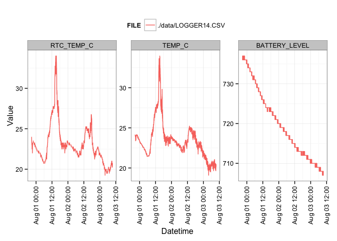
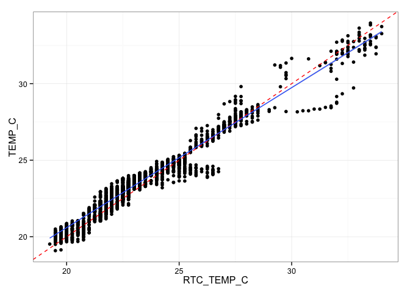
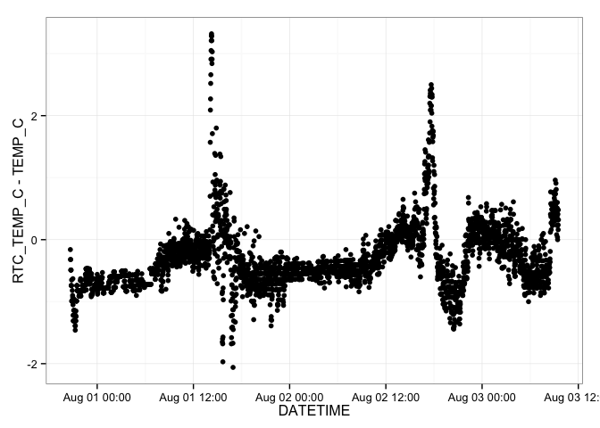
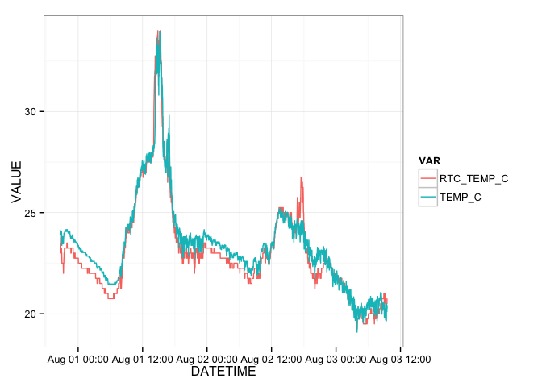

# Riffle-ito & Thermistor Deployment
Jeffrey D Walker  
August3 , 2014  

This document summarizes data collected using a [Riffle-ito Water Quality Data Logger](https://github.com/p-v-o-s/riffle-ito) connected to a [10K Precision Epoxy Thermistor](http://www.adafruit.com/products/372).

**Sketch**: [riffleito_thermistor_logger](https://github.com/walkerjeffd/riffle-ito-apps/blob/d137e07d5ac23a683431f4cc5cf6c404482cfeae/ino/riffleito_thermister_logger/riffleito_thermister_logger.ino)

**Purpose**: To determine the stability and battery-lifetime of a single riffle-ito deployment using a thermistor, and to compare the on-board RTC temperature measurements to the thermistor measurements.

**Description**: The riffle-ito was configured with the sketch above and set to record readings from a 10K thermistor every 60 seconds. Three fresh Duracell AA batteries were used to power the riffle-ito. Data are retrieved every few days resulting in short gaps and multiple data files, however the batteries were not changed.  

**Location**: The riffle-ito was placed on my dining room table in Brunswick, ME. 

## Set Up

First we'll load the R packages used for this summary.


```r
library(lubridate)
library(dplyr)
library(tidyr)
library(ggplot2)
theme_set(theme_bw())
```

## Load Data

The raw data are stored in the `./data` directory. To load the data, first retrieve a list of the filenames.


```r
filenames <- dir(path='./data', pattern='*.CSV', full.names = TRUE)
filenames
```

```
## [1] "./data/LOGGER14.CSV"
```

The `filenames` vector shows that there is/are 1 file(s).

We can then use the `dplyr::rbind_all` file to automatically loop through this set of filenames, load each file, append a column named `FILE` that stores the filename for each dataset, and finally merge the datasets for each file in a single data frame named `df`.


```r
df <- rbind_all(lapply(filenames, function (filename) {
  read.csv(filename, as.is=TRUE) %>%
    mutate(FILE=filename)
}))
head(df)
```

```
##              DATETIME RTC_TEMP_C TEMP_C BATTERY_LEVEL                FILE
## 1 2014-07-31 20:39:23      24.00  24.16           736 ./data/LOGGER14.CSV
## 2 2014-07-31 20:40:25      23.75  24.07           736 ./data/LOGGER14.CSV
## 3 2014-07-31 20:41:28      23.75  24.07           736 ./data/LOGGER14.CSV
## 4 2014-07-31 20:42:30      23.50  23.99           736 ./data/LOGGER14.CSV
## 5 2014-07-31 20:43:33      23.50  23.99           737 ./data/LOGGER14.CSV
## 6 2014-07-31 20:44:36      23.50  23.99           736 ./data/LOGGER14.CSV
```

Next, we want to parse the datetimes using `lubridate::ymd_hms()` to `POSIXct` objects, and convert the `FILE` column to a factor.


```r
df <- mutate(df,
             DATETIME=ymd_hms(DATETIME),
             FILE=factor(FILE))
summary(df)
```

```
##     DATETIME                     RTC_TEMP_C       TEMP_C     BATTERY_LEVEL
##  Min.   :2014-07-31 20:39:23   Min.   :19.2   Min.   :19.1   Min.   :707  
##  1st Qu.:2014-08-01 11:52:09   1st Qu.:21.8   1st Qu.:22.2   1st Qu.:712  
##  Median :2014-08-02 03:06:05   Median :22.8   Median :23.2   Median :719  
##  Mean   :2014-08-02 03:05:44   Mean   :23.1   Mean   :23.4   Mean   :720  
##  3rd Qu.:2014-08-02 18:19:08   3rd Qu.:23.8   3rd Qu.:24.1   3rd Qu.:726  
##  Max.   :2014-08-03 09:31:19   Max.   :34.0   Max.   :34.0   Max.   :737  
##                   FILE     
##  ./data/LOGGER14.CSV:3504  
##                            
##                            
##                            
##                            
## 
```

The data are currently in a wide format, where each column represents a single variable (see [Tidy Data](http://vita.had.co.nz/papers/tidy-data.pdf) and [Reshaping Data with the reshape Package](http://www.jstatsoft.org/v21/i12/paper) by Hadley Wickham for more information about long/wide formats, and note that `tidyr` is a relatively new package that provides much of the same functionality as the `reshape2` package). 

For plotting, it will be easier to convert to a long format. This can easily be done using the `tidyr::gather` function.


```r
df <- gather(df, VAR, VALUE, RTC_TEMP_C:BATTERY_LEVEL)
head(df)
```

```
##              DATETIME                FILE        VAR VALUE
## 1 2014-07-31 20:39:23 ./data/LOGGER14.CSV RTC_TEMP_C 24.00
## 2 2014-07-31 20:40:25 ./data/LOGGER14.CSV RTC_TEMP_C 23.75
## 3 2014-07-31 20:41:28 ./data/LOGGER14.CSV RTC_TEMP_C 23.75
## 4 2014-07-31 20:42:30 ./data/LOGGER14.CSV RTC_TEMP_C 23.50
## 5 2014-07-31 20:43:33 ./data/LOGGER14.CSV RTC_TEMP_C 23.50
## 6 2014-07-31 20:44:36 ./data/LOGGER14.CSV RTC_TEMP_C 23.50
```

```r
summary(df)
```

```
##     DATETIME                                    FILE      
##  Min.   :2014-07-31 20:39:23   ./data/LOGGER14.CSV:10512  
##  1st Qu.:2014-08-01 11:52:09                              
##  Median :2014-08-02 03:06:05                              
##  Mean   :2014-08-02 03:05:44                              
##  3rd Qu.:2014-08-02 18:19:08                              
##  Max.   :2014-08-03 09:31:19                              
##             VAR           VALUE      
##  RTC_TEMP_C   :3504   Min.   : 19.1  
##  TEMP_C       :3504   1st Qu.: 22.5  
##  BATTERY_LEVEL:3504   Median : 24.0  
##                       Mean   :255.5  
##                       3rd Qu.:712.0  
##                       Max.   :737.0
```

The data are now in long format with each row corresponding to one measurement for a single variable.

## Visualizations

We can plot the data with each panel showing one of the four variables. The data are colored by the corresponding filename. 


```r
ggplot(df, aes(DATETIME, VALUE, color=FILE)) +
  geom_line() +
  facet_wrap(~VAR, scales='free_y') +
  labs(x='Datetime', y='Value') +
  theme(axis.text.x=element_text(angle=90, hjust=1, vjust=0.5),
        legend.position='top')
```

 

We can compare the RTC on-board temperature to the thermistor temperature for verification. The red line in this figure is a 1:1 line of equality; the blue line is a linear regression. This figure shows good agreement between the thermistor temperature (`TEMP_C`) and the RTC temperature (`RTC_TEMP_C`).


```r
spread(df, VAR, VALUE) %>%
  ggplot(aes(RTC_TEMP_C, TEMP_C)) +
  geom_point() +
  geom_abline(color='red', linetype=2) +
  geom_smooth(method='lm')
```

 

The differences between the RTC and thermistor temperature show an interesting (i.e. non-regular) pattern over time.


```r
spread(df, VAR, VALUE) %>%
  ggplot(aes(DATETIME, RTC_TEMP_C-TEMP_C)) +
  geom_point()
```

 

As another comparison, we can plot timeseries of the RTC temperature and the thermistor temperature on the same figure.


```r
filter(df, VAR %in% c("RTC_TEMP_C", "TEMP_C")) %>%
ggplot(aes(DATETIME, VALUE, color=VAR)) +
  geom_line()
```

 

The differences may be caused by sunlight warming the thermistor (which is black). Also for some of the deployment, the thermistor was hanging off the edge of the table, so it was not in the exact same location as the RTC.

# Conclusions

Based on these plots, I conclude:

- The riffle-ito is able to collect stable thermistor measurements over time
- As of right now, the riffle-ito has been operational for **2.536 days** on only 3 AA batteries taking measurements every ~60 seconds. However, it is still running as I write this.
- There is strong agreement between the thermistor and RTC temperatures. The mean difference between the two (`RTC_TEMP_C-TEMP_C`) was -0.45 degC indicating higher temperatures measured by the thermistor. This could probably be corrected by measuring the actual resistance of the series resistor used in the thermistor circuit.
