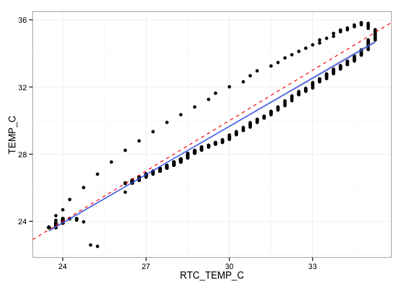
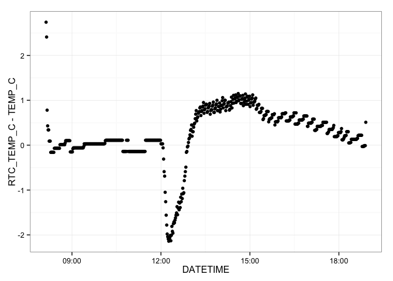
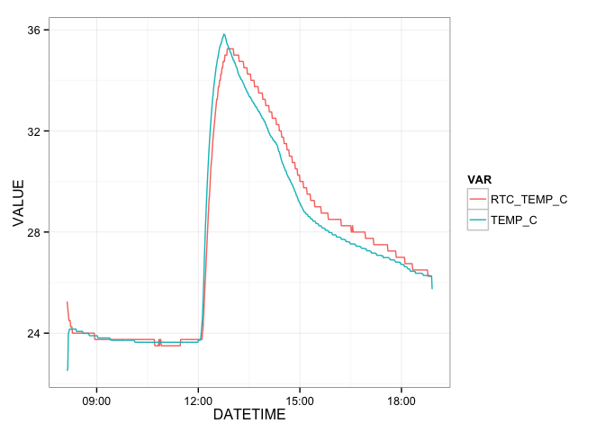

# Riffle-ito & Thermistor Submerged Deployment
Jeffrey D Walker  
August 6, 2014  

This document summarizes data collected using a [Riffle-ito Water Quality Data Logger](https://github.com/p-v-o-s/riffle-ito) connected to a [10K Precision Epoxy Thermistor](http://www.adafruit.com/products/372) and submerged in a jar of water.

**Sketch**: [riffleito_thermistor_logger](https://github.com/walkerjeffd/riffle-ito-apps/blob/d137e07d5ac23a683431f4cc5cf6c404482cfeae/ino/riffleito_thermister_logger/riffleito_thermister_logger.ino)

**Purpose**: To test the ability to measure temperature when submerged. And to make sure the enclosure does not leak.

**Description**: The riffle-ito was configured with the sketch above and set to record readings from a 10K thermistor every 60 seconds. The jar was submerged in hot tap water around noon to induce a change in temperature.

**Location**: The riffle-ito was placed in a large glass jar in kitchen in Brunswick, ME. 

## Set Up

First we'll load the R packages used for this summary.


```r
library(lubridate)
library(dplyr)
library(tidyr)
library(ggplot2)
theme_set(theme_bw())
```

## Load Data

The raw data are stored in the `./data` directory. To load the data, first retrieve a list of the filenames.


```r
filenames <- dir(path='./data', pattern='*.CSV', full.names = TRUE)
filenames
```

```
## [1] "./data/LOGGER17.CSV"
```

The `filenames` vector shows that there is/are 1 file(s).

We can then use the `dplyr::rbind_all` file to automatically loop through this set of filenames, load each file, append a column named `FILE` that stores the filename for each dataset, and finally merge the datasets for each file in a single data frame named `df`.


```r
df <- rbind_all(lapply(filenames, function (filename) {
  read.csv(filename, as.is=TRUE) %>%
    mutate(FILE=filename)
}))
head(df)
```

```
##              DATETIME RTC_TEMP_C TEMP_C BATTERY_LEVEL                FILE
## 1 2014-08-06 08:07:38      25.25  22.51           710 ./data/LOGGER17.CSV
## 2 2014-08-06 08:08:40      25.00  22.59           710 ./data/LOGGER17.CSV
## 3 2014-08-06 08:09:43      24.75  23.97           710 ./data/LOGGER17.CSV
## 4 2014-08-06 08:10:46      24.50  24.07           710 ./data/LOGGER17.CSV
## 5 2014-08-06 08:11:48      24.50  24.16           709 ./data/LOGGER17.CSV
## 6 2014-08-06 08:12:51      24.50  24.16           710 ./data/LOGGER17.CSV
```

Next, we want to parse the datetimes using `lubridate::ymd_hms()` to `POSIXct` objects, and convert the `FILE` column to a factor.


```r
df <- mutate(df,
             DATETIME=ymd_hms(DATETIME),
             FILE=factor(FILE))
summary(df)
```

```
##     DATETIME                     RTC_TEMP_C       TEMP_C     BATTERY_LEVEL
##  Min.   :2014-08-06 08:07:38   Min.   :23.5   Min.   :22.5   Min.   :704  
##  1st Qu.:2014-08-06 10:49:00   1st Qu.:23.8   1st Qu.:23.8   1st Qu.:705  
##  Median :2014-08-06 13:30:47   Median :27.2   Median :27.0   Median :705  
##  Mean   :2014-08-06 13:30:52   Mean   :27.6   Mean   :27.4   Mean   :706  
##  3rd Qu.:2014-08-06 16:12:44   3rd Qu.:30.0   3rd Qu.:29.3   3rd Qu.:708  
##  Max.   :2014-08-06 18:54:24   Max.   :35.2   Max.   :35.8   Max.   :710  
##                   FILE    
##  ./data/LOGGER17.CSV:620  
##                           
##                           
##                           
##                           
## 
```

The data are currently in a wide format, where each column represents a single variable (see [Tidy Data](http://vita.had.co.nz/papers/tidy-data.pdf) and [Reshaping Data with the reshape Package](http://www.jstatsoft.org/v21/i12/paper) by Hadley Wickham for more information about long/wide formats, and note that `tidyr` is a relatively new package that provides much of the same functionality as the `reshape2` package). 

For plotting, it will be easier to convert to a long format. This can easily be done using the `tidyr::gather` function.


```r
df <- gather(df, VAR, VALUE, RTC_TEMP_C:BATTERY_LEVEL)
head(df)
```

```
##              DATETIME                FILE        VAR VALUE
## 1 2014-08-06 08:07:38 ./data/LOGGER17.CSV RTC_TEMP_C 25.25
## 2 2014-08-06 08:08:40 ./data/LOGGER17.CSV RTC_TEMP_C 25.00
## 3 2014-08-06 08:09:43 ./data/LOGGER17.CSV RTC_TEMP_C 24.75
## 4 2014-08-06 08:10:46 ./data/LOGGER17.CSV RTC_TEMP_C 24.50
## 5 2014-08-06 08:11:48 ./data/LOGGER17.CSV RTC_TEMP_C 24.50
## 6 2014-08-06 08:12:51 ./data/LOGGER17.CSV RTC_TEMP_C 24.50
```

```r
summary(df)
```

```
##     DATETIME                                    FILE     
##  Min.   :2014-08-06 08:07:38   ./data/LOGGER17.CSV:1860  
##  1st Qu.:2014-08-06 10:49:00                             
##  Median :2014-08-06 13:30:47                             
##  Mean   :2014-08-06 13:30:52                             
##  3rd Qu.:2014-08-06 16:12:44                             
##  Max.   :2014-08-06 18:54:24                             
##             VAR          VALUE      
##  RTC_TEMP_C   :620   Min.   : 22.5  
##  TEMP_C       :620   1st Qu.: 25.3  
##  BATTERY_LEVEL:620   Median : 29.7  
##                      Mean   :253.7  
##                      3rd Qu.:705.0  
##                      Max.   :710.0
```

The data are now in long format with each row corresponding to one measurement for a single variable.

## Visualizations

We can plot the data with each panel showing one of the four variables. The data are colored by the corresponding filename. 


```r
ggplot(df, aes(DATETIME, VALUE, color=FILE)) +
  geom_line() +
  facet_wrap(~VAR, scales='free_y') +
  labs(x='Datetime', y='Value') +
  theme(axis.text.x=element_text(angle=90, hjust=1, vjust=0.5),
        legend.position='top')
```

 

We can compare the RTC on-board temperature to the thermistor temperature for verification. The red line in this figure is a 1:1 line of equality; the blue line is a linear regression. This figure shows good agreement between the thermistor temperature (`TEMP_C`) and the RTC temperature (`RTC_TEMP_C`).


```r
spread(df, VAR, VALUE) %>%
  ggplot(aes(RTC_TEMP_C, TEMP_C)) +
  geom_point() +
  geom_abline(color='red', linetype=2) +
  geom_smooth(method='lm')
```

 

The differences between the RTC and thermistor temperature show an interesting (i.e. non-regular) pattern over time.


```r
spread(df, VAR, VALUE) %>%
  ggplot(aes(DATETIME, RTC_TEMP_C-TEMP_C)) +
  geom_point()
```

 

As another comparison, we can plot timeseries of the RTC temperature and the thermistor temperature on the same figure.


```r
filter(df, VAR %in% c("RTC_TEMP_C", "TEMP_C")) %>%
ggplot(aes(DATETIME, VALUE, color=VAR)) +
  geom_line()
```

 

The differences between the RTC and thermistor temperatures are probably caused by the RTC being within the enclosure, and the thermistor exposed to the water outside the enclosure.

# Conclusions

Based on these plots, I conclude:

- The VOSS water bottle enclosure did not leak.
- The thermistor was able to measure changes in water temperature and collected stable measurements.
