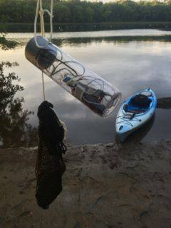

## What I Did

I attached a [riffle-ito](https://github.com/p-v-o-s/riffle-ito/) to my kayak and paddled around the Androscoggin River. I also had an Arduino Uno with a GPS Shield logging my location. 

Here's what the set up looked like:


To keep the enclosure submerged, I tied a bag of rocks to it.



Here is a video showing some highlights from the deployment.

<iframe width="560" height="315" src="//www.youtube.com/embed/t26eL-m8-zo?fs=1" frameborder="0" allowfullscreen></iframe>

Note: This is an Rmarkdown document. The [data files](https://github.com/walkerjeffd/riffle-ito-apps/tree/master/analyses/20140807_kayak/data) and [source code](https://github.com/walkerjeffd/riffle-ito-apps/blob/master/analyses/20140807_kayak/index.Rmd) used to generate this document all the figures are available in the github [repo](https://github.com/walkerjeffd/riffle-ito-apps).

```{r libraries, message=FALSE, warning=FALSE, echo=FALSE}
library(dplyr)
library(tidyr)
library(lubridate)
library(ggplot2)
library(knitr)
library(ggmap)
theme_set(theme_bw())
opts_chunk$set(echo=FALSE, message=FALSE, warning=FALSE)
```

## Results

### GPS Data

```{r load gps}
gps <- read.csv('./data/GPSLOG02.CSV', header=FALSE, as.is=TRUE)
names(gps) <- c('DATETIME_UTC','FIX','FIX_QUALITY','LATITUDE','LONGITUDE','SPEED','ANGLE','ALTITUDE','NUM_SATELLITES')
gps <- mutate(gps, DATETIME=ymd_hms(DATETIME_UTC, tz="UTC") %>% with_tz(tzone="US/Eastern"),
              LATITUDE=floor(LATITUDE/100) + (LATITUDE %% 100)/60,
              LONGITUDE=floor(LONGITUDE/100) + (LONGITUDE %% 100)/60,
              LONGITUDE=-LONGITUDE) %>%
  filter(LATITUDE > 0)
```

Here's what the GPS data looks like:

```{r show gps, echo=TRUE}
head(gps)
```

This map shows the locations recorded by the GPS:

```{r map_path}
map <- get_map(location=c(lon=mean(range(gps$LONGITUDE)), lat=mean(range(gps$LATITUDE))),
               zoom=15, maptype="satellite")
ggmap(map, darken=c(0.25, "white"), extent="device") +
  geom_point(aes(LONGITUDE, LATITUDE), data=gps, color='red', size=1)
```

### Riffle-ito Data

```{r load riffle}
riffle <- read.csv('data/LOGGER22.CSV', as.is=TRUE)
riffle <- mutate(riffle, DATETIME=ymd_hms(DATETIME, tz="US/Eastern"))
```

Here's what the riffle-tio data look like.

```{r show riffle, echo=TRUE}
head(riffle)
```

Here is a timeseries of the riffle-ito temperature. Note the high temperature at the beginning and low temperature at the end are not actually measurements of the water temperature, but rather the air temperature as I moved the riffle from my house to the kayak before setting out, and then back from the kayak to the house after returning.

```{r plot_temp}
ggplot(riffle, aes(DATETIME, TEMP_C)) +
  geom_line() +
  labs(x="Time", y="Temp (degC)")
```

### Merge GPS and Riffle-ito Data

To merge the GPS and Riffle-ito data (which are in separate data tables), I computed the mean location and mean temperature at 1-minute intervals. Then I joined the two tables by the 1-minute rounded timestamps.

```{r merge}
riffle.1min <- group_by(riffle, DATETIME=round_date(DATETIME, unit='minute')) %>%
  summarise(N.WQ=n(),
            TEMP_C=mean(TEMP_C))
gps.1min <- group_by(gps, DATETIME=round_date(DATETIME, unit='minute')) %>%
  summarise(N.GPS=n(),
            LATITUDE=mean(LATITUDE),
            LONGITUDE=mean(LONGITUDE))
df <- merge(riffle.1min, gps.1min, by="DATETIME", all=TRUE) %>%
  filter(!is.na(LATITUDE))
```

The data now look like this:

```{r show merge, echo=TRUE}
head(df)
```

#### Temperature Map

This map shows the track with points colored by temperature. The data are filtered to only show values when the sensor was in the water.

```{r map_temp}
ggmap(map, darken=c(0.25, "white"), extent="device") +
  geom_point(aes(LONGITUDE, LATITUDE, color=TEMP_C), 
             data=filter(df, DATETIME>=ymd_hm("2014-08-07 18:10", tz="US/Eastern"), 
                             DATETIME<=ymd_hm("2014-08-07 19:17", tz="US/Eastern")), 
             size=1) +
  scale_color_gradient(low='green', high='red')
```

#### Outfall

I expected to see a change around the Brunswick Water Treatment Plant outfall. The following map zooms into this location (you can see the treatment plant in the lower left). 

```{r map_outfall, message=FALSE, warning=FALSE}
df.outfall <- filter(df, DATETIME>=ymd_hm("2014-08-07 18:30", tz="US/Eastern"), 
                         DATETIME<=ymd_hm("2014-08-07 18:57", tz="US/Eastern"))
map.outfall <- get_map(location=c(lon=mean(range(df.outfall$LONGITUDE)), 
                                  lat=mean(range(df.outfall$LATITUDE))),
                       zoom=17, maptype="satellite")
                      
ggmap(map.outfall, darken=c(0.25, "white"), extent="device") +
  geom_point(aes(LONGITUDE, LATITUDE, color=TEMP_C), 
             data=df.outfall, 
             size=3) +
  scale_color_gradient(low='green', high='red')
```

Here is a photo of the outfall.


Unfortunately, I didn't see much difference. The outfall temperature is probably similar to the water temperature at this time of year. However, the lowest temperature point (the green point) is located right next to the outfall.

#### Return Trip Temperature

You can however see how the temperature dropped on the return trip, which was close to sunset and thus probably reflects the cooling air temperature. This figure shows the temperature values, with the shapes of the symbols indicating whether the point was collected as I was heading out to the outfall or heading back to the house.

```{r map_temp_return}
ggmap(map, darken=c(0.25, "white"), extent="device") +
  geom_point(aes(LONGITUDE, LATITUDE, color=TEMP_C, 
                 shape=DATETIME>=ymd_hm("2014-08-07 18:50", tz="US/Eastern")), 
             data=filter(df, DATETIME>=ymd_hm("2014-08-07 18:10", tz="US/Eastern"), 
                             DATETIME<=ymd_hm("2014-08-07 19:17", tz="US/Eastern")), 
             size=2) +
  scale_color_gradient(low='green', high='red') +
  scale_shape_discrete("Direction", labels=c("Heading Out", "Heading Back"))
```

And this compares the same values as a timeseries. I'm not sure what caused the blips in this figure.

```{r plot_temp_ts}
filter(df, DATETIME>=ymd_hm("2014-08-07 18:10", tz="US/Eastern"), 
                             DATETIME<=ymd_hm("2014-08-07 19:17", tz="US/Eastern")) %>%
  mutate(DIRECTION=DATETIME>=ymd_hm("2014-08-07 18:50", tz="US/Eastern")) %>%
  ggplot(aes(DATETIME, TEMP_C, color=TEMP_C, 
             shape=DATETIME>=ymd_hm("2014-08-07 18:50", tz="US/Eastern"))) +
  geom_point() +
  geom_line() +
  scale_color_gradient(low='green', high='red') +
  scale_shape_discrete("Direction", labels=c("Heading Out", "Heading Back")) +
  labs(x="Time", y="Temp (degC)")
```

## Conclusions

- The VOSS water bottle enclosure seemed to work and keep the riffle-ito dry.
- The GPS shield worked great.
- I forgot to change the measurement frequency of the riffle-ito, which was set to 60 seconds. I should have reduced this to 10 seconds (or less) to take more measurements as battery life was not a major concern.
- To keep the riffle-ito submerged, I tied a bag of rocks to it. This seemed to work, but induced significant drag and made it harder to paddle (I should have anticipated this). The depth of the sensor also varied from approximately 1-2 ft below the water surface to within an inch of the surface depending on my speed (higher speed, less depth). It would be ideal to keep the sensor at a constant depth as temperature may decrease with depth. So a more robust and stable contraption is needed for dragging the riffle-ito behind a kayak. 
- I detected no significant temperature signature from the outfall. I suspect this is because the temperature of the outfall discharge is similar to that of the river water at this time of year. Repeating this experiment in the fall may reveal a stronger signal as the outfall temperature will likely be higher than the river temperature. Conductivity measurements will also likely show an effect of the outfall.