# Riffle-ito + Thermistor + Photocell Kayak Deployment
Jeffrey D Walker, PhD  
August 8, 2014  

I took a riffle-ito with a thermister and photocell out in my kayak. I stopped at three locations in the middle of the riffle, and slowly lowered the riffle to the bottom, and then slowly pulled it back up. THe goal was to see if I could measure a change in light levels, and whether the temperature decreased with depth indicating stratification. I also had an Arduino Uno with a GPS Shield logging my location.

## R Libraries


```r
library(dplyr)
library(tidyr)
library(lubridate)
library(ggplot2)
library(ggmap)
theme_set(theme_bw())
```

## GPS Data


```r
gps <- read.csv('./data/GPSLOG10.CSV', header=FALSE, as.is=TRUE)
names(gps) <- c('DATETIME_UTC','FIX','FIX_QUALITY','LATITUDE','LONGITUDE','SPEED','ANGLE','ALTITUDE','NUM_SATELLITES')
gps <- mutate(gps, DATETIME=ymd_hms(DATETIME_UTC, tz="UTC") %>% with_tz(tzone="US/Eastern"),
              LATITUDE=floor(LATITUDE/100) + (LATITUDE %% 100)/60,
              LONGITUDE=floor(LONGITUDE/100) + (LONGITUDE %% 100)/60,
              LONGITUDE=-LONGITUDE) %>%
  filter(LATITUDE > 0)
```

Here are the locations recorded by the GPS, which show the path of the kayak. I didn't turn on the GPS until I got in the kayak, and it apparently took a few minutes for it to fix a signal. Next time, I should turn on the GPS a few minutes before I leave.


```r
map <- get_map(location=c(lon=mean(range(gps$LONGITUDE)), lat=mean(range(gps$LATITUDE))),
               zoom=17, maptype="satellite")
```

```
## Map from URL : http://maps.googleapis.com/maps/api/staticmap?center=43.922395,-69.960757&zoom=17&size=%20640x640&scale=%202&maptype=satellite&sensor=false
## Google Maps API Terms of Service : http://developers.google.com/maps/terms
```

```r
ggmap(map, darken=c(0.25, "white"), extent="device") +
  geom_point(aes(LONGITUDE, LATITUDE), data=gps, color='red', size=1)
```

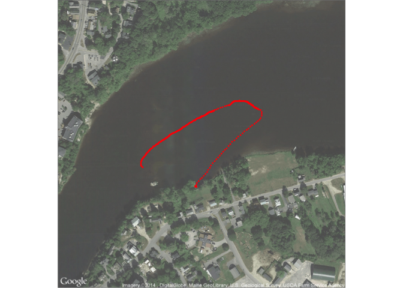 

## Riffle-ito Data

Load the riffle-ito data from a csv file. Note that the `PHOTO` values are inversely proportional to the light levels (higher PHOTO values -> lower light levels). So I'll reverse the PHOTO values by subtracting them from the maximum analog reading of 1023 (as was done by [Adafruit](https://learn.adafruit.com/photocells/using-a-photocell)). 


```r
wq <- read.csv('data/LOGGER36.CSV', as.is=TRUE)
wq <- mutate(wq, DATETIME=ymd_hms(DATETIME, tz="US/Eastern")) %>%
  filter(DATETIME <= max(gps$DATETIME)) # %>%
#   mutate(PHOTO=1023-PHOTO) # reverse
head(wq)
```

```
##              DATETIME RTC_TEMP_C TEMP_C PHOTO BATTERY_LEVEL
## 1 2014-08-08 18:13:10         26  26.63   428           706
## 2 2014-08-08 18:13:15          0  26.63   382           706
## 3 2014-08-08 18:13:21         26  26.63   511           706
## 4 2014-08-08 18:13:26         27  26.63   350           706
## 5 2014-08-08 18:13:31         27  26.63   519           706
## 6 2014-08-08 18:13:37         27  26.63   398           706
```

### Temperature Data

Here is a timeseries of the riffle-ito temperature. 


```r
ggplot(wq, aes(DATETIME, TEMP_C)) +
  geom_line() +
  labs(x="Time", y="Temp (degC)")
```

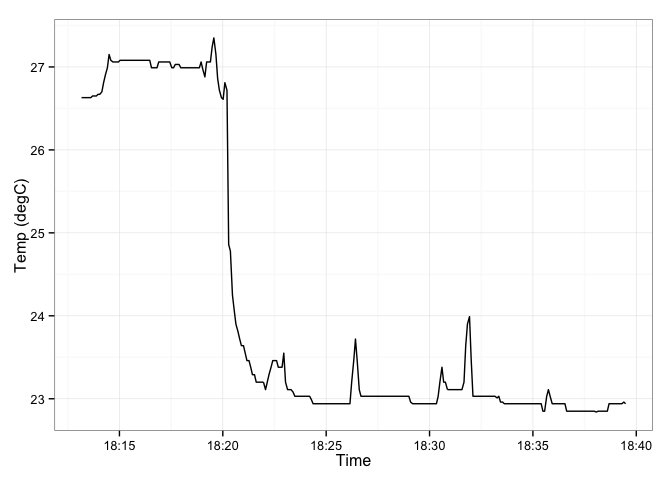 

Note the high temperature at the beginning reflects the hot air temperature in my house. I'll truncate the data to begin at 18:22 when the riffle was outside.


```r
wq <- filter(wq, DATETIME >= ymd_hms("2014-08-08 18:22:00", tz="US/Eastern"))
```

Now plot the raw data again.


```r
ggplot(wq, aes(DATETIME, TEMP_C)) +
  geom_line() +
  labs(x="Time", y="Temp (degC)")
```

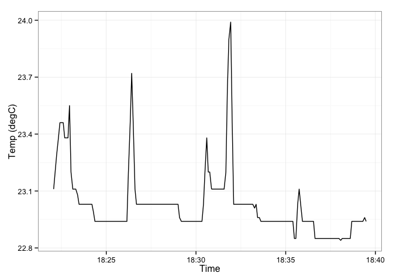 

### Light Data

Here is a timeseries of the riffle-ito photoresistor. The high values indicate high light levels.


```r
ggplot(wq, aes(DATETIME, PHOTO)) +
  geom_line() +
  labs(x="Time", y="Photo")
```

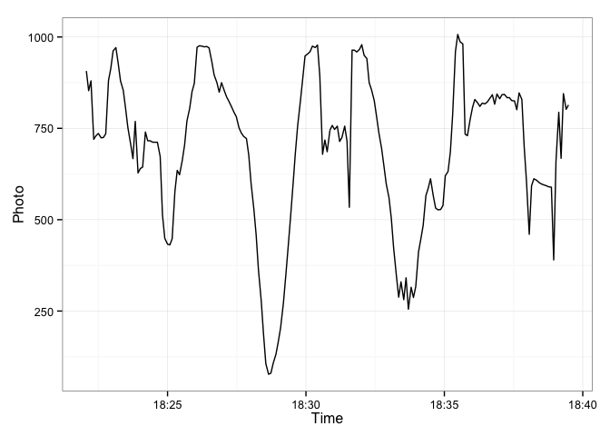 

### Photo vs. Temperature Comparison

To determine if the bottom water had lower temperature than the air, we can make a scatter plot. Surprisingly, we see the opposite trend with the highest temperatures corresponding to the lowest light levels.


```r
ggplot(wq, aes(TEMP_C, PHOTO)) +
  geom_point() +
  labs(x="Temp (degC)", y="Photo")
```

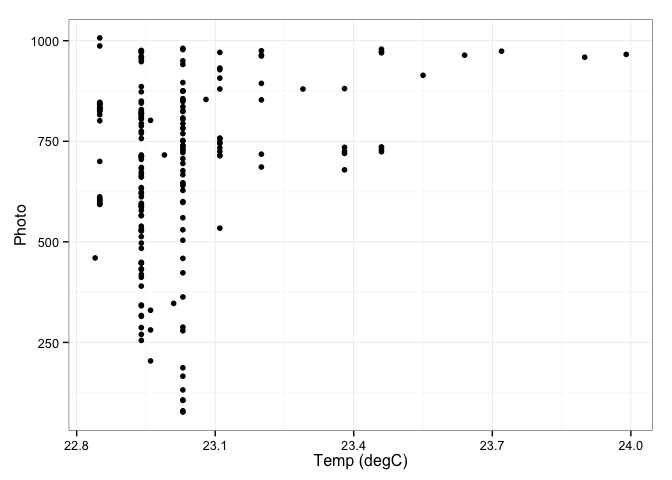 

## Merge GPS and Riffle-ito Data

To merge the GPS and Riffle-ito data, I'll linearly interpolate the longitude, latitude, and speed as recorded by the GPS to match the time points measured by the riffle. Then I'll join the two tables by the 1-minute rounded DATETIME.


```r
gps.interp <- data.frame(DATETIME=wq$DATETIME,
                         LONGITUDE=approx(x=gps$DATETIME, y=gps$LONGITUDE, 
                                          xout=wq$DATETIME)$y,
                         LATITUDE=approx(x=gps$DATETIME, y=gps$LATITUDE, 
                                         xout=wq$DATETIME)$y,
                         SPEED=approx(x=gps$DATETIME, y=gps$SPEED, 
                                         xout=wq$DATETIME)$y
                         )
df <- merge(wq, gps.interp, by="DATETIME", all.x=TRUE)
```

## Temperature Map

This map shows the track with points colored by temperature. I'm also truncating the end of the trip to remove data when I was paddling home (as the riffle was out of the water and in the canoe). Note the two locations with the highest temperature.


```r
df <- filter(df, DATETIME<=ymd_hms("2014-08-08 18:36:00", tz="US/Eastern"))
ggmap(map, darken=c(0.25, "white"), extent="device") +
  geom_point(aes(LONGITUDE, LATITUDE, color=TEMP_C), data=df, size=2) +
  scale_color_gradient(low='green', high='red')
```

```
## Warning: Removed 11 rows containing missing values (geom_point).
```

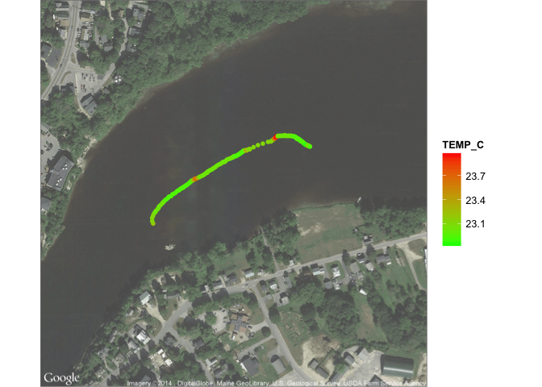 

## Photo Map
And this is a map of the light levels. 


```r
ggmap(map, darken=c(0.25, "white"), extent="device") +
  geom_point(aes(LONGITUDE, LATITUDE, color=PHOTO), data=df, size=2) +
  scale_color_gradient(low='green', high='red')
```

```
## Warning: Removed 11 rows containing missing values (geom_point).
```

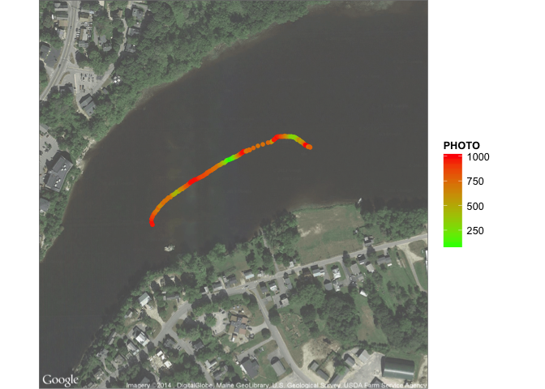 

## Photo vs. Speed

To try and identify which riffle measurements were collected when the riffle was in the water, I can try plotting my speed vs the photo level. 


```r
ggplot(df, aes(SPEED, PHOTO)) +
  geom_point()
```

```
## Warning: Removed 11 rows containing missing values (geom_point).
```

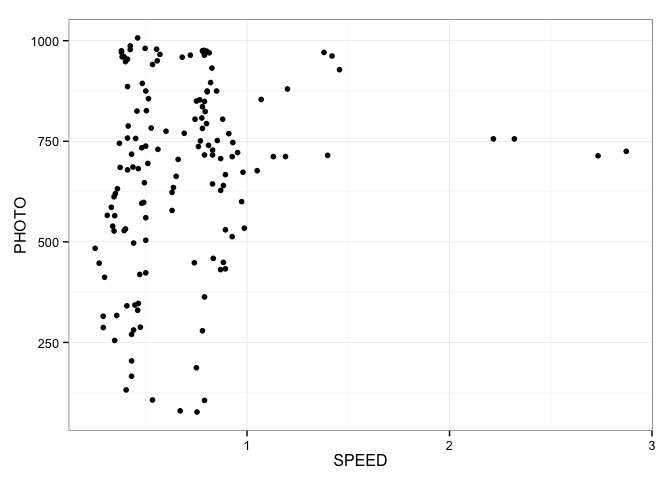 

This figure plots light levels, temperature and speed on identical x-axes for comparison. The time with high speed was when I paddled from the second drop to the third drop location. 


```r
filter(df, DATETIME > ymd_hm("2014-08-08 18:25", tz="US/Eastern")) %>%
  select(DATETIME, TEMP_C, PHOTO, SPEED) %>%
  gather(VAR, VALUE, TEMP_C, PHOTO, SPEED) %>%
  ggplot(aes(DATETIME, VALUE)) +
  geom_line() +
  facet_wrap(~VAR, scales='free_y', ncol=1)
```

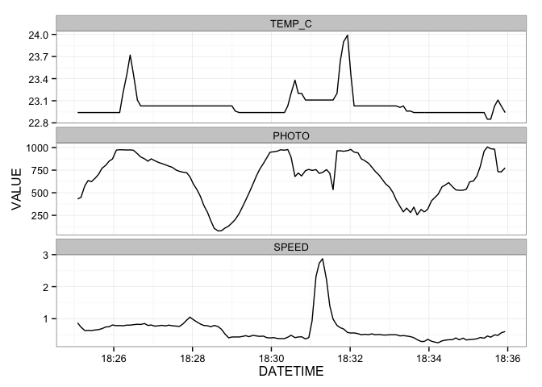 

## First Drop

Here is the light level over time colored by temperature for the first drop. I'm not completely sure if this is set to the proper beginning. It may have begin around 18:24:30 because the higher temperatures at the beginning of the drop suggest the riffle-ito may have been responding to the air temperature, and that it didn't start measuring the water temperature until around 18:24:30.


```r
filter(df,
       DATETIME >= ymd_hms("2014-08-08 18:23:00", tz="US/Eastern"),
       DATETIME <= ymd_hms("2014-08-08 18:26:10", tz="US/Eastern")) %>%
ggplot(aes(DATETIME, PHOTO, color=TEMP_C)) +
  geom_point(size=3) +
  geom_line() +
  scale_color_gradient(low='green', high='red')
```

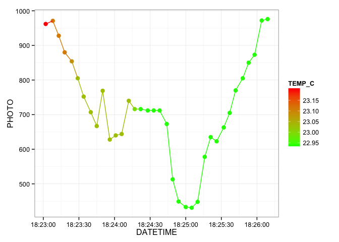 

This figure shows the same data and indicates higher temperatures at higher light levels. Although based on the previous figure, we know these are from the beginning of the drop when the riffle may have simply been adjusting to the air temperature, or been slowly responding to the change from air to water.


```r
filter(df,
       DATETIME >= ymd_hms("2014-08-08 18:23:00", tz="US/Eastern"),
       DATETIME <= ymd_hms("2014-08-08 18:26:10", tz="US/Eastern")) %>%
ggplot(aes(PHOTO, TEMP_C, color=TEMP_C)) +
  geom_point(size=3) +
  scale_color_gradient(low='green', high='red')
```

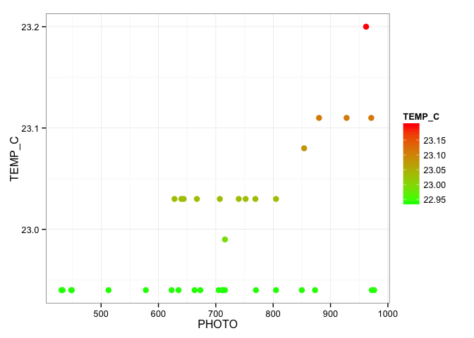 

And here is a map of the first drop location. The green areas show where the riffle was close to the bottom with the lowest light.


```r
ggmap(map, darken=c(0.25, "white"), extent="device") +
  geom_point(aes(LONGITUDE, LATITUDE, color=PHOTO), 
             data=filter(df, DATETIME >= ymd_hms("2014-08-08 18:23:00", tz="US/Eastern"),
                             DATETIME <= ymd_hms("2014-08-08 18:26:10", tz="US/Eastern")), 
             size=2) +
  scale_color_gradient(low='green', high='red')
```

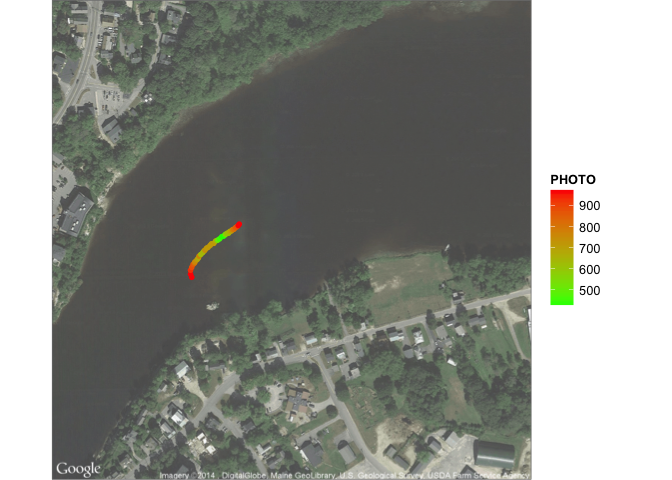 

And here's the same map colored by temperature. Clearly the temperature was higher at the beginning than the end. If this experiment worked correctly then I'd expect the same kind of pattern with the lowest temperature corresponding to the lowest light levels.


```r
ggmap(map, darken=c(0.25, "white"), extent="device") +
  geom_point(aes(LONGITUDE, LATITUDE, color=TEMP_C), 
             data=filter(df, DATETIME >= ymd_hms("2014-08-08 18:23:00", tz="US/Eastern"),
                             DATETIME <= ymd_hms("2014-08-08 18:26:10", tz="US/Eastern")), 
             size=2) +
  scale_color_gradient(low='green', high='red')
```

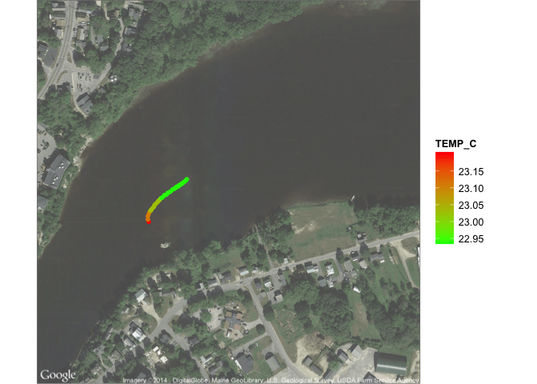 

## Second Drop

Here is the light level over time colored by temperature for the second drop. Again, I would expect to see the lowest temperatures corresponding to the lowest light levels.


```r
filter(df,
       DATETIME >= ymd_hms("2014-08-08 18:26:35", tz="US/Eastern"),
       DATETIME <= ymd_hms("2014-08-08 18:30:20", tz="US/Eastern")) %>%
ggplot(aes(DATETIME, PHOTO, color=TEMP_C)) +
  geom_point(size=3) +
  geom_line() +
  scale_color_gradient(low='green', high='red')
```

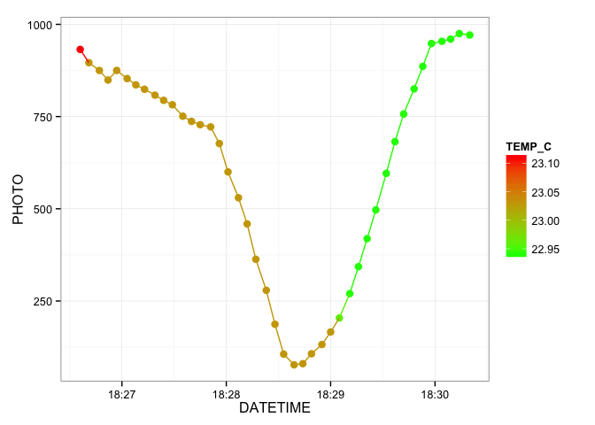 

And here is a map of the second drop location. 


```r
ggmap(map, darken=c(0.25, "white"), extent="device") +
  geom_point(aes(LONGITUDE, LATITUDE, color=PHOTO), 
             data=filter(df, DATETIME >= ymd_hms("2014-08-08 18:26:35", tz="US/Eastern"),
                             DATETIME <= ymd_hms("2014-08-08 18:30:20", tz="US/Eastern")), 
             size=2) +
  scale_color_gradient(low='green', high='red')
```

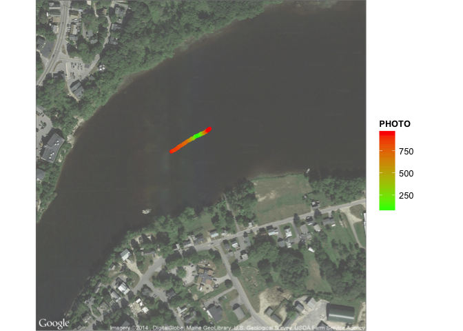 

And here's the same map colored by temperature. Again the temperature was higher at the beginning than the end. 


```r
ggmap(map, darken=c(0.25, "white"), extent="device") +
  geom_point(aes(LONGITUDE, LATITUDE, color=TEMP_C), 
             data=filter(df, DATETIME >= ymd_hms("2014-08-08 18:26:35", tz="US/Eastern"),
                             DATETIME <= ymd_hms("2014-08-08 18:30:20", tz="US/Eastern")), 
             size=2) +
  scale_color_gradient(low='green', high='red')
```

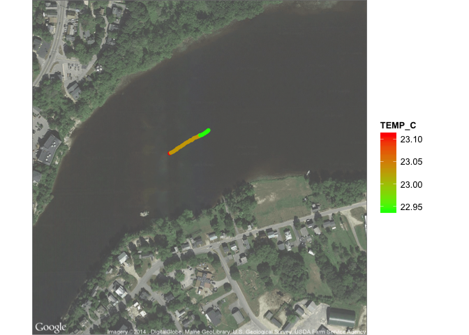 

## Third Drop

Finally, light levels for the final drop. Same pattern as before.


```r
filter(df,
       DATETIME >= ymd_hms("2014-08-08 18:32:05", tz="US/Eastern"),
       DATETIME <= ymd_hms("2014-08-08 18:35:30", tz="US/Eastern")) %>%
ggplot(aes(DATETIME, PHOTO, color=TEMP_C)) +
  geom_point(size=3) +
  geom_line() +
  scale_color_gradient(low='green', high='red')
```

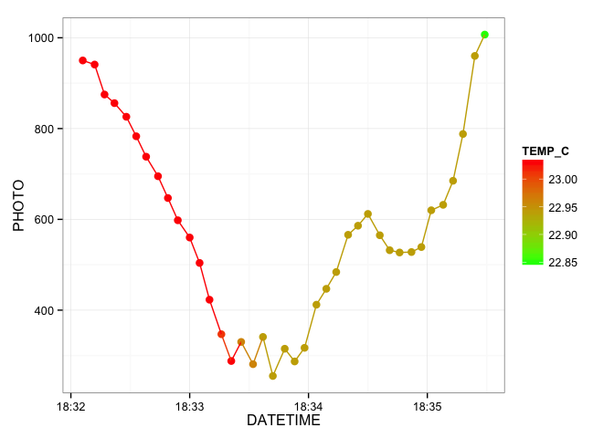 

And the map of light levels


```r
ggmap(map, darken=c(0.25, "white"), extent="device") +
  geom_point(aes(LONGITUDE, LATITUDE, color=PHOTO), 
             data=filter(df, DATETIME >= ymd_hms("2014-08-08 18:32:05", tz="US/Eastern"),
                             DATETIME <= ymd_hms("2014-08-08 18:35:30", tz="US/Eastern")), 
             size=2) +
  scale_color_gradient(low='green', high='red')
```

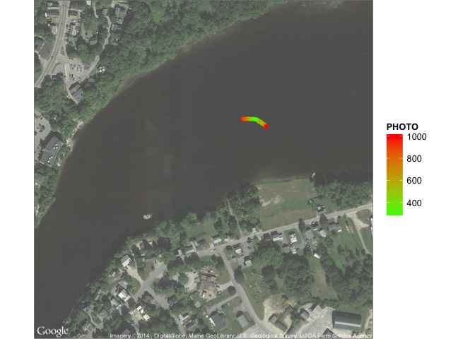 

And the map of temperature.


```r
ggmap(map, darken=c(0.25, "white"), extent="device") +
  geom_point(aes(LONGITUDE, LATITUDE, color=TEMP_C), 
             data=filter(df, DATETIME >= ymd_hms("2014-08-08 18:32:05", tz="US/Eastern"),
                             DATETIME <= ymd_hms("2014-08-08 18:35:30", tz="US/Eastern")), 
             size=2) +
  scale_color_gradient(low='green', high='red')
```

 

# Conclusions

- The photocell seemed to work pretty well. It was able to detect light even near the bottom of the river and produced stable and consistent results.
- The temperature data were not as expected. I think the river may be well mixed here as it is just downstream of a large dam. So there is no stratification. 
- The enclosure seemed to hold up well under pressure. After the second drop it came back up with a large dent that was probably caused by the high water pressure (the second drop point was the deepest).
- Next time I'll try to turn the GPS on a few minutes before leaving, and I'll record the exact times of each drop. I'll also try to do it in the middle of the day when the sun is overhead.
- A depth sensor would be very valuable, but one could also record the depth by marking the rope to which the riffle is attached (e.g. every foot, note the exact time). With depth estimates during the drop, we could construct a relationship between light and depth and thus estimate the light extinction coefficient.
- I'm not entirely sure if there was a large effect with the enclosure rotating as it descended. The sun was setting, so if it is facing West to start, but then rotates to face east, it would probably detect a change in light due to the change in the angle between the photocell and the sun. Also, the light sensor was located along one side, pointing towards the bottom of the enclosure (so that it would face towards the water surface as it was lowered). It would be useful to figure out a way to have the light sensor on the very bottom of the enclosure so that it would not be obscured by the other wires and boards in the enclosure, and would not be effected by rotations.
